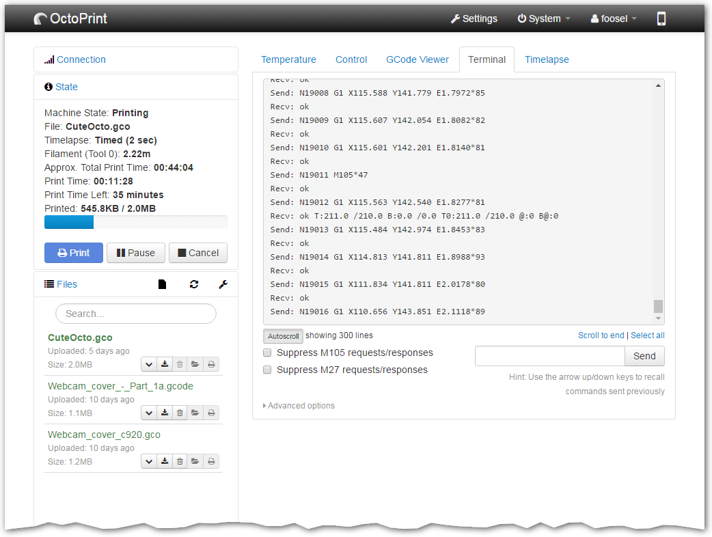
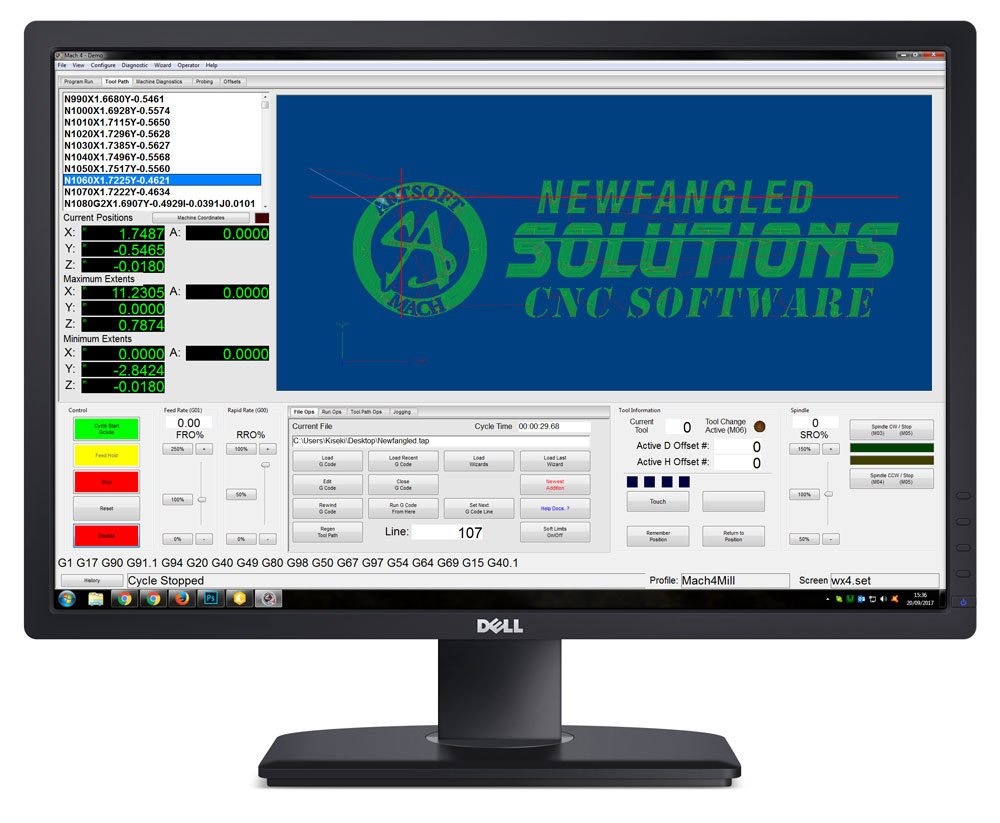
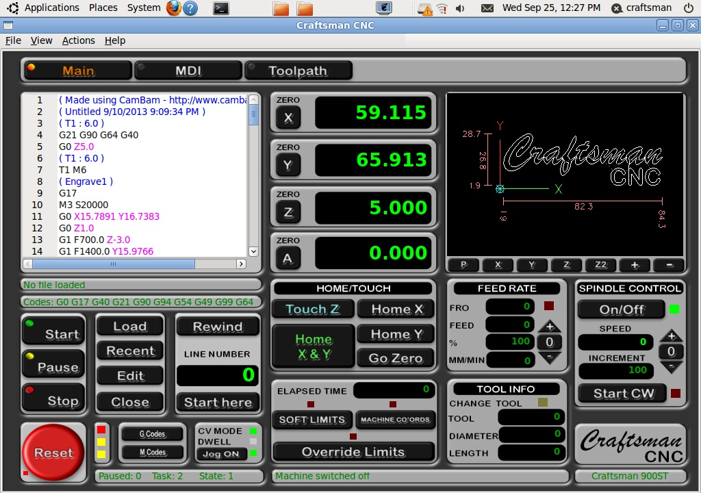

Now we've got a half-usable motion controller, we need a graphical way for
humans to interact with it. The controller runs in a browser, which makes 
[Vue][vue-js] a perfect candidate for the UI.

## Adding Vue to the Frontend

Now, we don't actually have much frontend code (47 lines of JavaScript to be 
exact) so it's actually easier to delete the existing `frontend` and use the
[`vue` CLI tool][vue-cli] to create a new one.

```console
$ rm -r frontend
$ yarn global add @vue/cli
$ vue create frontend
  Vue CLI v3.11.0
  ? Please pick a preset: Manually select features
  ? Check the features needed for your project: Babel, TS
  ? Use class-style component syntax? Yes
  ? Use Babel alongside TypeScript (required for modern mode, auto-detected polyfills, transpiling JSX)? Yes
  ? Where do you prefer placing config for Babel, PostCSS, ESLint, etc.? In dedicated config files
  ? Save this as a preset for future projects? No
  
  ...
```

{}
Make sure to check the *TypeScript* and *Babel* options when creating
`frontend`.
{}

Any JavaScript that uses WASM code must be loaded asynchronously so we'll use
the same trick that the `rustwasm/create-wasm-app` used, a `bootstrap.js` shim.

```js
// frontend/src/bootstrap.js

// A dependency graph that contains any wasm must all be imported
// asynchronously. This `bootstrap.js` file does the single async import, so
// that no one else needs to worry about it again.
import("./main.ts")
    .catch(e => console.error("Error importing `main.ts`:", e));
```

If we want our `bootstrap.js` shim to be called, we'll need to tell Webpack
to use it as the app's entrypoint.

```js
// frontend/vue.config.js

const path = require("path");

module.exports = {
    configureWebpack: config => {
        config.entry.app = path.join(__dirname, "src", "bootstrap.js");
    }
}
```

We'll also delete some of the junk that comes with the default scaffold so our
`App` just displays *"Hello, World"*. This gives us a nice clean slate to work
from.

```vue
// frontend/src/App.vue

<template>
  <div id="app">
    <h1>Hello, World!</h1>
  </div>
</template>

<script lang="ts">
import { Component, Vue } from "vue-property-decorator";

@Component({})
export default class App extends Vue {}
</script>
```

If you start the dev server now (`yarn serve`), you should hopefully be
greeted by a page saying *"Hello, World!"*.

## Wiring `aimc_sim` Up to the Frontend Again

Now we've got a working frontend, we can wire up the `aimc_sim` crate so it's
able to interact with the UI again.

First, don't forget to add the WASM code generated by the `sim` crate to our
new `frontend`.

```console
yarn add ../sim/pkg
```

Next in order to support Vue's reactive way of doing things, we'll need to 
rewrite the `Browser` module so it'll accept a reference to some JavaScript
object.

We want to take advantage of `wasm-bindgen`'s ability to work with [Duck-typed 
interfaces][ducks] so the top-level Vue `App` can communicate with the motion
controller by passing down something that has some pre-defined methods.

```rust
// sim/src/browser.rs

use aimc_comms::Tx;
use aimc_fps_counter::{Fps, FpsSink};
use wasm_bindgen::prelude::*;

#[wasm_bindgen]
extern "C" {
    /// An arbitrary JavaScript object which implements the [`Browser`]
    /// interface.
    pub type Browser;

    #[wasm_bindgen(structural, method)]
    pub fn set_fps(this: &Browser, frequency: f32, tick_duration_ms: f32);

    #[wasm_bindgen(structural, method)]
    pub fn send_data(this: &Browser, data: &[u8]);
}

/// Wrapper around a JavaScript [`Browser`] object which implements the various
/// system traits.
pub struct B<'a>(pub &'a Browser);

impl<'a> FpsSink for B<'a> {
    fn emit_fps(&mut self, fps: Fps) {
        self.0
            .set_fps(fps.frequency, fps.tick_duration.as_secs_f32() * 1000.0)
    }
}

impl<'a> Tx for B<'a> {
    fn send(&mut self, data: &[u8]) { self.0.send_data(data); }
}
```

Believe it or not, but this makes the `aimc_sim::App` *cleaner* because we 
aren't binding to the DOM directly, and therefore don't have to worry about
setup failing. 

I'll elide the changes to `sim/src/app.rs` for now seeing as they're mostly
mechanical code changes. The WASM functions exported by `lib.rs` are kinda
important though, seeing as that's the interface our frontend will be using.

```rust
// sim/src/lib.rs

#[wasm_bindgen]
pub fn setup_world() -> App { App::new(Inputs::default()) }

#[wasm_bindgen]
pub fn poll(app: &mut App, browser: &Browser) { app.poll(browser); }
```

Now the Rust code has been updated to work with the browser, we can attach it
to the Vue `App` component and wire up an `animate()` function to be called
every time the browser refreshes.

```vue
// frontend/src/App.vue

<script lang="ts">
import { Component, Vue } from "vue-property-decorator";
import * as wasm from "aimc_sim";

@Component({})
export default class App extends Vue {
  private app?: wasm.App;
  private animateToken = 0;

  mounted() {
    // setup the world
    this.app = wasm.setup_world();

    // and schedule the animate() function to be called on the next tick
    this.animateToken = requestAnimationFrame(this.animate.bind(this));
  }

  beforeDestroy() {
    // make sure the animate method is cancelled when this component is removed
    // from the screen
    cancelAnimationFrame(this.animateToken);

    // don't forget to drop() our App
    if (this.app) {
      this.app.free();
      this.app = undefined;
    }
  }

  animate() {
    // schedule animate to be called again
    this.animateToken = requestAnimationFrame(this.animate.bind(this));

    if (this.app) {
      // poll the app to let it make progress
      wasm.poll(this.app, this);
    }
  }
}
</script>
```

If you squint, you can almost see our [original `index.js`][original] in
there...

You may have also noticed that the call to `wasm.poll()` is passed a reference
to `this`. That means we'll need to implement the `Browser` "interface" on 
`App`.

```vue
// frontend/src/App.vue

<script lang="ts">
import { Component, Vue } from "vue-property-decorator";
import * as wasm from "aimc_sim";

@Component({})
export default class App extends Vue {
  ...
  public frequency = 0;
  public tick_duration_ms = 0;

  ...

  set_fps(frequency: number, tick_duration_ms: number) {
    this.frequency = Math.round(frequency * 10) / 10;
    this.tick_duration_ms = Math.round(tick_duration_ms * 10) / 10;
  }

  send_data(data: Uint8Array) {
    console.log(new TextDecoder("utf-8").decode(data));
    // TODO: actually handle the message...
  }
}
</script>
```

Now we've got access to the FPS counter again, we may as well add it to the
rendered document.

```vue
// frontend/src/App.vue

<template>
  <div id="app">
    <h1>Hello, World!</h1>
    <p>{{frequency}} Hz ({{tick_duration_ms*1000}} μs)</p>
  </div>
</template>

<script lang="ts">
...
</script>
```

Restarting the dev server and going to http://localhost:8080/ again will show
our *Hello, World!* and a rapidly changing FPS counter.

<video controls src="simple-ui.webm" type="video/webm" style="width:100%"></video>

{}
After letting the JIT warm up for a while, the *"average tick duration"* seems
to hover between 0 and 100 μs. This appears to be the best resolution the
browser's `performance.now()` will give us.

Now we're not directly manipulating the DOM and leaving Vue to do the
deduplication of UI changes, our `poll()` function is a couple orders of
magnitude faster.
{}

## Scouting the Competition

The first step when designing a UI is to look at what other people have done for
inspiration.

This screenshot of [OctoPrint][octo] web UI, showing their *"terminal"* tab
looks promising. We'll probably want something similar to the terminal for 
diagnostics and viewing the raw messages as they go back and forth.



Another example, more machine-oriented this time, is [Mach4][m4]. This is a 
commercial desktop program commonly used to control CNC machines.



Another option is the highly configurable [LinuxCNC][linux-cnc].



Some elements they all have in common:

- Lots of numbers and buttons, preferring functionality over aesthetics
- Some sort of pseudo-text editor for viewing the program sent to the machine
- Instantaneous axis positions
- Buttons for triggering various automation sequences
- Colours which indicate whether things are "happy" (or not) at a glance
- A 3D preview which shows how the job might look when cut

[vue-js]: https://vuejs.org/
[vue-cli]: https://cli.vuejs.org/guide/installation.html
[ducks]: https://rustwasm.github.io/docs/wasm-bindgen/reference/working-with-duck-typed-interfaces.html
[original]: https://github.com/Michael-F-Bryan/adventures-in-motion-control/blob/2459d6e02d72ac9a012fe002ffd89876716670fb/frontend/index.js
[octo]: https://octoprint.org/
[m4]: https://www.machsupport.com/software/mach4/
[linux-cnc]: http://linuxcnc.org/