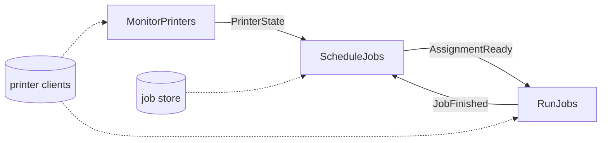
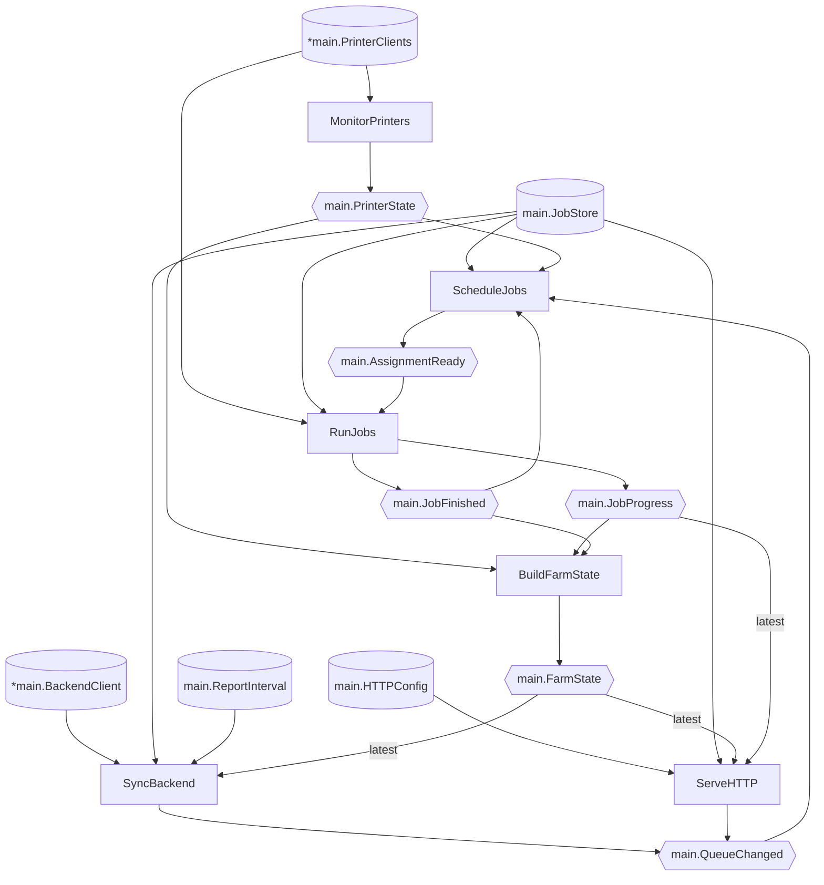

Imagine you look after the software for a small 3D-print farm: a rack of printers and a Go service running on a box in the corner. The service started life as a dashboard. Somebody wanted to see what each printer was doing without walking over to it, so you wrote a little HTTP server, and because the handlers needed live printer state, the server's setup code connected to the printers and started a goroutine to poll them. That was completely reasonable.

Then the central backend came along. Jobs now arrive from upstream, so the service grew a goroutine that pulls them down into a SQLite-backed job store. Something has to match queued jobs to idle printers, so it grew a scheduler. Something has to actually send G-code to a printer and watch it happen, so it grew a runner. Each of these landed in the same setup path, because that's where the printer connections and the store already lived, and each was a small, sensible change that took an afternoon.

A while later the backend team asked for periodic status reports, and by then nobody even paused before adding another goroutine to the pile. The setup code now looks something like this:

```go
func NewServer(cfg Config) (*Server, error) {
	printers, err := ConnectPrinters(cfg.Printers)
	if err != nil {
		return nil, err
	}

	store, err := OpenJobStore(cfg.DatabasePath)
	if err != nil {
		return nil, err
	}

	s := &Server{
		printers: printers,
		store:    store,
		backend:  NewBackendClient(cfg.BackendURL, cfg.APIKey),
		state:    newStateCache(),
	}

	go s.watchPrinters()  // the dashboard needs live state
	go s.pullJobs()       // jobs arrive from the backend
	go s.schedule()       // idle printer + queued job → assignment
	go s.runAssignments() // someone has to actually print things
	go s.reportUpstream() // the backend wants status reports

	return s, nil
}
```

This code isn't obviously bad. Each line was a reasonable next step, and the application does print things. The trouble is that the setup code now owns all of the application's long-running work.

## Then Someone Asks for Graceful Shutdown

The problem showed up when somebody asked for graceful shutdown. Deploying a new version of the service means killing the process, and killing the process mid-print ruins whatever was on the beds and leaves half-claimed jobs in limbo. The request is simple enough: when the service receives `SIGTERM`, it should stop accepting new work, let the runner get each printer to a safe stopping point, record which assignments were interrupted so the next process can pick them up, and then exit.

You sit down to thread cancellation through the code, and the questions start piling up. Which goroutines are even running? The only way to answer is to read the setup code and everything it calls. What order should they stop in? The scheduler feeds the runner through a channel. If the scheduler exits first, who closes it, and is the runner allowed to finish draining it? The puller and the reporter both talk to the backend; do they share a shutdown deadline? Every background failure so far has just been logged and forgotten, and now some of them are supposed to trigger an orderly teardown instead. All of these answers have to be expressed *inside an HTTP server object*, because that's the thing that owns everything.

None of these questions is hard on its own. You stop and ask whether there's a better way because the code gives you nowhere to answer them. The lifetimes you're being asked to coordinate are implicit in five `go` statements and the order of some struct fields.

## An Accidental Runtime

Every application with more than one long-lived activity has a runtime in the small, whether or not anyone designed it: something decides what those activities are, what they're allowed to touch, how they hear about each other, and when they stop. We normally reserve the word "runtime" for the machinery underneath the language, but your application has one of its own. In the print-farm service, that setup code lives in `NewServer`. This wasn't a deliberate choice. The HTTP server was simply the first object that needed the shared state, so it became the place where long-running things get born, and every later addition reinforced the pattern. That's what I mean by an *accidental* application runtime.

Calling this "large setup code" misses what has changed. The service now has five concurrent components with fairly clear responsibilities and well-defined data flowing between them. You could sketch them on a whiteboard in a minute, once you'd worked them out, but no artefact in the codebase expresses that design. It exists only in the side effects of wiring code: a field here, a `go` statement there, a channel threaded through two private methods. "A web server with some helpers" stopped being a true description a long time ago. The application has developed a larger architecture without representing it as one.

Graceful shutdown happened to be the request that exposed this for me. For you it might be a component you can't test without standing up the whole process, a new feature with no obvious home, or a new team member asking "what talks to what?" and watching you open six files to answer. These are all signs that the application's working architecture is only visible indirectly.

HTTP is only one place this happens. The same accretion happens to a CLI command's run function, the setup code around a message-queue consumer, a GUI main window, or a `main()` that grew organically. Wherever starting the application revolves around one convenient object, that object gradually becomes the runtime. HTTP servers are unusually good hosts for the pattern because they're long-lived, they're created early, and every feature eventually wants to show something to a user.

This design grew out of a real Go edge service that talks to hardware, whose details aren't mine to share. I wrote the print-farm service from scratch for this article to recreate the same pressures. If it feels oddly specific in places, that's why.

## Prior Art: PX4

Once I'd named the problem, I wanted prior art for making this kind of architecture explicit. The codebase that taught me the most wasn't a web framework. It was [PX4][px4], the open-source drone autopilot. I've spent a fair amount of time in its source and documentation. It makes our print farm look leisurely, with sensor drivers producing data at hundreds of hertz, estimators fusing it, controllers consuming the estimates, telemetry, logging, and dozens of other concurrent activities running on a flight controller.

Three ideas from [PX4's architecture][px4-arch] transfer almost directly.

**Modules within one process.** PX4 is built as self-contained modules that communicate through asynchronous message passing, but it is not a distributed system: the modules share an address space and run as tasks or on shared work queues. It provided the strong internal boundaries I was missing without requiring separate services.

**Typed topics alongside shared facilities.** Modules exchange messages over [uORB][uorb], a publish/subscribe bus where each topic carries one well-known message type. Just as usefully, PX4 doesn't force everything through the bus: broadly-used facilities like parameters sit outside the message graph and are accessed directly. The architecture gives streams of events and stable shared services different mechanisms.

**Topology you can generate.** Because modules declare their subscriptions and publications in code, PX4 can extract a [graph of modules and topics][uorb-graph] straight from the source. The architecture diagram isn't a wiki page that rots; it's derived from the same declarations that run the system.

I want to give proper credit here because the shape of everything that follows is borrowed from PX4. I've chosen different delivery guarantees, though. uORB is tuned for control loops: a topic's default queue holds a single message, and newer publications overwrite any unread value. That works when only the freshest gyro sample matters. A completion event such as "a job finished" needs different treatment. The design below defaults to backpressured delivery, treats latest-value delivery as an explicit concept, and makes no attempt to reproduce uORB's implementation, multi-instance topics, or lifecycle for starting and stopping individual modules.

## Modules as Ordinary Functions

So: what's the smallest way to say "this application is a set of concurrent modules that exchange typed messages and share a few resources" in Go, without inventing a schema language, a registration DSL, or a framework the reader has to learn?

My answer, after some false starts, is that you already say it every time you write a function signature:

```go
func MonitorPrinters(
	ctx context.Context,
	printers *PrinterClients,
	states chan<- PrinterState,
) error
```

Read that signature the way you'd read a sentence. This long-running activity participates in a shared lifecycle (`ctx`), needs access to the printer connections (`*PrinterClients`), produces a stream of `PrinterState` values (`chan<- PrinterState`), and can fail (`error`). The runtime and a colleague reading the code can see that static wiring in ordinary Go vocabulary. Delivery semantics, failure policy, shutdown phases, and any workers the module owns remain separate contracts.

That observation became a small library, which I've called `backplane`. A module is any `func(ctx context.Context, ...dependencies) error`, and each parameter after the context declares one dependency:

| Parameter type         | Meaning                                             |
| ---------------------- | --------------------------------------------------- |
| `chan<- T`             | publish to the topic carrying `T`                   |
| `<-chan T`             | subscribe to the topic carrying `T`                 |
| `*backplane.Latest[T]` | observe the most recent `T` (we'll get to this one) |
| anything else          | a resource supplied by the caller                   |

A topic is identified by the exact Go type flowing through it. There are no topic strings to typo and no schema compiler. Any number of modules can publish or subscribe to the same type, and every subscriber receives every value. Type identity is both schema and address: if two streams carry the same fields but mean different things, they need distinct named wrapper types.

The API on top is deliberately small:

```go
app, err := backplane.New(MonitorPrinters, ScheduleJobs, RunJobs /* , ... */)
// inspect it:
fmt.Print(app.Graph().Mermaid())
// or run it:
err = app.Run(ctx, printers, store)
```

`New` *records* the module signatures; it never calls a module. Keeping declaration separate from execution means the same signatures can produce an architecture diagram without opening a database connection, while `Run` can validate the entire wiring before a single module starts. Registering a function is simultaneously writing executable code and writing down where that code sits in the design.

Two contracts matter here because the accidental version blurred both of them.

First, **messages versus resources**. `PrinterState` is a flow of values; the job store is a capability. The accidental runtime put the state cache, store, and subscriptions on one struct, where everything could touch everything else. Here, a stream is a channel parameter and a resource is any other parameter, and the two are wired differently.

Second, **messages versus calls**. Nothing forces request/response work through the bus. When an HTTP handler needs to pause a job *and tell the user whether that worked*, a direct method call on the store is the honest contract, and the module simply declares the store as a resource. Topics carry events between concurrent components; ordinary calls still handle request/response work.

The uniform `ctx`-and-`error` shape also makes lifecycle and failure part of the contract. Every module must accept a context, so module authors deal with cancellation from the start instead of retrofitting it later. Every module must also return an `error`, which gives failures somewhere legitimate to go besides a log line inside a forgotten goroutine.

Here's the rough shape we're heading towards, using a slice of the print farm. Modules are boxes, typed topics label the arrows, and resources use dashed lines:



Completions feed back into scheduling, so the modules form a set of peers rather than a pipeline that terminates at a web handler.

That loop also creates a liveness constraint. Fan-out is sequential and backpressured, so a module in a cycle must keep consuming its inputs while long-running work proceeds. `RunJobs`, for example, would hand prints to workers it owns and continue receiving assignments; if it blocked in a print while publishing completions, the scheduler and runner could eventually wait on each other. Backplane exposes the cycle, but it cannot make the module safe.

{} Everything in this article comes from a real, tested library: [`backplane`][repo], published under Apache-2.0. The sections below show the parts of the implementation where the interesting decisions live, and the repository carries the complete implementation and tests for its lifecycle and delivery contracts.

If you spot a bug, in the code or the prose, let me know on the blog's [issue tracker][issue]!

[repo]: https://github.com/sunfish-robotics/backplane
[issue]: https://github.com/Michael-F-Bryan/adventures.michaelfbryan.com
{}

## Why Not Wire It Explicitly?

Ordinary module functions, explicitly constructed channels, and an `errgroup` are the baseline, not a lesser design. They already give you explicit dependencies, cancellation, joining, and functions you can test directly. If that composition root remains easy to read, I would keep it.

Backplane earns its place when the same mechanics start repeating: fan-out and topic completion, validation before anything starts, type-based resource binding, and a topology derived from the declarations that actually run. The point is not that every concurrent Go service needs a runtime library. It is that once those contracts have become application infrastructure, writing them once is better than rebuilding them around every goroutine.

## Reading Signatures

The core of the whole idea is a compact function that looks at a parameter type and decides what kind of dependency it declares:

```go
func inspectParameter(parameterType reflect.Type) (parameter, error) {
	if parameterType == contextType {
		return parameter{}, errors.New("context.Context may only appear as the first parameter")
	}
	if messageType, ok := latestMessageType(parameterType); ok {
		return parameter{kind: latestParameter, typeOf: parameterType, topicType: messageType}, nil
	}
	if parameterType.Kind() == reflect.Chan {
		p := parameter{typeOf: parameterType, topicType: parameterType.Elem()}
		switch parameterType.ChanDir() {
		case reflect.SendDir:
			p.kind = publisherParameter
		case reflect.RecvDir:
			p.kind = subscriberParameter
		default:
			return parameter{}, errors.New("channels must be directional: chan<- T publishes, <-chan T subscribes")
		}
		return p, nil
	}
	return parameter{kind: resourceParameter, typeOf: parameterType}, nil
}
```

(Ignore the `latestParameter` branch for now; it gets introduced properly in a few sections.)

One decision in there deserves a comment: bidirectional channels are rejected outright. A plain `chan T` parameter compiles fine and would even work, but it doesn't *say* which way data flows. Accepting that ambiguity would defeat the point of using signatures as wiring documentation.

Around this sits `inspectModule`, which requires a non-nil, non-variadic function with `context.Context` first and exactly one `error` result. `New` runs that inspection over every module and then cross-checks the topics. A module that subscribes to a topic no module publishes is rejected on the spot. The check has the same flavour as an unsatisfied import: you've declared a dependency on something that doesn't exist, so refusing to start is kinder than letting a subscriber block forever at 2am. All of this happens before any module code runs, which is what makes the side-effect-free `Graph()` possible.

## Running the Modules

`Run(ctx, resources...)` has two jobs: bind the caller's resources to the declared parameters, and supervise the modules.

Resource binding stays simple. The caller passes already-created values, with no providers or factories. Each resource parameter binds to exactly one value: first by exact type, then by *unique* assignability, so a concrete `*SQLiteJobStore` can satisfy a `JobStore` interface without ceremony. Nil values, duplicate types, ambiguous matches, missing resources, and unused resources are all rejected before any module starts. Rejecting an unused resource occasionally annoys me for about ten seconds. Then I remember it's almost always a wiring mistake I'd rather hear about now.

I did consider letting the library create resources too, and decided firmly against it. In practice the composition root wants to be ordinary Go at the top of `main`: open the store, `defer store.Close()`, pass it in. If the runtime owns resource creation, it also needs ordering, error policies, health checks, and cleanup. At that point it has become a dependency-injection framework, which is a much bigger thing than I ever wanted. It would also make declaration and graph inspection perform I/O: needing a live database connection to render an architecture diagram is silly. Backplane only binds values; the caller owns them.

Supervision is `errgroup` semantics, because those are the semantics I always end up wanting anyway:

```go
group, groupContext := errgroup.WithContext(ctx)

// Binding is elided here. The derived groupContext is installed as the first
// argument for every module, followed by its resources and topic channels.

for _, t := range topics {
	group.Go(func() error {
		t.pump(groupContext)
		return nil
	})
}
for _, inv := range invocations {
	group.Go(func() error {
		defer func() {
			if inv.done != nil {
				close(inv.done)
			}
			for _, t := range inv.published {
				t.publisherDone()
			}
		}()
		result := inv.module.fn.Call(inv.args)[0].Interface()
		if result == nil {
			return nil
		}
		return fmt.Errorf("module %s: %w", inv.module.name, result.(error))
	})
}
return group.Wait()
```

A module returning `nil` finishes quietly and its siblings carry on. Finite publishers use the same module contract as everything else. The first module to return an error cancels every sibling's context, while cancelling the context passed to `Run` shuts the whole application down. `Run` waits for every module before it returns. This gives errors a strong meaning: modules absorb or retry recoverable failures, and returning an error means the application cannot safely continue. The deferred calls to `inv.done` and `publisherDone()` tell each topic that one of its modules has finished; the next section explains why the topics care.

One deliberate omission is dynamic registration. The module set is fixed at `New`. A module that needs short-lived workers spawns its own goroutines, joins them before returning, and folds their failures into its own error. Those workers remain an implementation detail of the module. Every use case I came up with for dynamic registration was better served by a static module that sits mostly idle, and a fixed set is what makes the graph trustworthy.

## Moving Values Around

Topics are where the concurrency actually lives, and this is the code I'd least want a reader to hand-wave past. Each publisher parameter gets its own unbuffered channel into the topic; a per-topic pump goroutine receives values and fans them out:

```go
func (t *topic) pump(ctx context.Context) {
	defer t.finish()

	topicDone := reflect.SelectCase{Dir: reflect.SelectRecv, Chan: reflect.ValueOf(t.done)}
	contextDone := reflect.SelectCase{Dir: reflect.SelectRecv, Chan: reflect.ValueOf(ctx.Done())}
	inputs := slices.Clone(t.inputs)
	cancelled := false

	for {
		cases := make([]reflect.SelectCase, 0, len(inputs)+2)
		cases = append(cases, topicDone, contextDone)
		if cancelled {
			cases[1].Chan = reflect.Value{} // a zero Chan is never ready
		}
		for _, input := range inputs {
			cases = append(cases, reflect.SelectCase{Dir: reflect.SelectRecv, Chan: input})
		}

		chosen, value, ok := reflect.Select(cases)
		switch {
		case chosen == 0: // every publisher has returned
			return
		case chosen == 1:
			cancelled = true
		case !ok: // a module closed its publisher channel: stop receiving from it
			inputs = slices.Delete(inputs, chosen-2, chosen-1)
		case cancelled: // cancellation interrupts delivery: drain and drop
		default:
			if t.latest != nil {
				t.latest.publish(value, time.Now())
			}
			cancelled = !t.deliver(value, contextDone)
		}
	}
}

// deliver hands value to every live subscriber, blocking until each accepts
// it. It reports false if the context was cancelled mid-delivery.
func (t *topic) deliver(value reflect.Value, contextDone reflect.SelectCase) bool {
	for index := range t.subscribers {
		sub := &t.subscribers[index]
		if sub.dead {
			continue
		}
		chosen, _, _ := reflect.Select([]reflect.SelectCase{
			{Dir: reflect.SelectSend, Chan: sub.channel, Send: value},
			{Dir: reflect.SelectRecv, Chan: sub.moduleDone},
			contextDone,
		})
		switch chosen {
		case 1: // the subscribing module returned: drop its subscription
			sub.dead = true
		case 2:
			return false
		}
	}
	return true
}
```

The delivery contract is **in-process, memory-only, and backpressured**, but the exact timing matters. A publisher's unbuffered send returns when the pump accepts the value, before `deliver` necessarily reaches every subscriber. The pump then holds that one value until every live subscriber accepts it, so a slow subscriber prevents the pump from accepting the next publication. A publisher can get one delivery ahead; a successful send is not an acknowledgement from downstream. There is no durability, replay, retry, or acknowledgement. If losing a message would matter after a crash, the message was never the right place for that information. We'll return to this when we rebuild the print farm.

Most of the subtlety is in shutdown and completion:

- **A topic completes when every module publishing to it has returned.** At
  that point the subscriber channels are closed, so
  `for value := range subscription` is the natural consumption loop and
  terminates by itself. Completion tracks module lifetimes, not channels.
- **A finished subscriber stops participating.** If a module returns while
  its siblings are still publishing, its abandoned subscription is dropped
  (that's the `moduleDone` case above) rather than continuing to backpressure
  the topic.
- **Cancellation drains.** After the context is cancelled, the pump keeps
  receiving but drops the values, so a publisher blocked in a bare send can
  unwind and get on with its own shutdown. Yes, that means cancellation can
  lose in-flight values; that's part of the contract, and it's why durable
  facts don't live on the bus.
- **Closing a channel you were handed is a fault backplane tolerates.** The
  channels belong to the runtime, and a module has no business closing one,
  but if it does, only that module's own later sends panic; the topic keeps
  working for everyone else, and completion still waits for the module to
  actually return.

This is a fan-out loop with a handful of `select` cases. What matters is having the behaviour implemented once and covered by tests. In the accidental runtime, each of those decisions was spread across five goroutines.

## Rebuilding the Print Farm

Rebuilding the service tests the design against something messier than a pipeline.

Deciding the module boundaries is mostly deciding who owns what. The central backend owns job creation, queue membership, and priority. Arguing with it locally would mean building conflict resolution I don't want to teach or maintain. The local HTTP interface owns the immediate physical controls: pause, cancel, take a printer out of service. SQLite, behind an opaque `JobStore` interface, owns everything that must survive a restart: queued jobs, claimed assignments, and terminal outcomes. The bus handles live, in-process coordination.

That split produces six modules:

```go
// Watches the printers, publishing a snapshot whenever one changes.
func MonitorPrinters(ctx context.Context, printers *PrinterClients,
	states chan<- PrinterState) error

// Pulls jobs from the central backend into the store, announces changes,
// and periodically reports current farm state upstream.
func SyncBackend(ctx context.Context, backend *BackendClient, jobs JobStore,
	interval ReportInterval, farm *backplane.Latest[FarmState],
	queueChanged chan<- QueueChanged) error

// The dashboard and local controls: reads current state, streams updates
// over SSE, and applies operator actions through the store.
func ServeHTTP(ctx context.Context, config HTTPConfig, jobs JobStore,
	farm *backplane.Latest[FarmState], progress *backplane.Latest[JobProgress],
	queueChanged chan<- QueueChanged) error

// Matches persisted queued work against live printer availability and
// durably claims assignments.
func ScheduleJobs(ctx context.Context, jobs JobStore, states <-chan PrinterState,
	changed <-chan QueueChanged, finished <-chan JobFinished,
	assignments chan<- AssignmentReady) error

// Executes assignments on printers, persisting outcomes and publishing
// live progress.
func RunJobs(ctx context.Context, printers *PrinterClients, jobs JobStore,
	assignments <-chan AssignmentReady, progress chan<- JobProgress,
	finished chan<- JobFinished) error

// Folds printer state, progress, and outcomes into one current view of
// the farm.
func BuildFarmState(ctx context.Context, printers <-chan PrinterState,
	progress <-chan JobProgress, finished <-chan JobFinished,
	farm chan<- FarmState) error
```

`ServeHTTP` is now one peer among six. It has real dependencies and can pause a job through the store, but it no longer starts the rest of the application. `BuildFarmState` consumes three topics and publishes a derived one without doing any I/O. The accidental runtime had this logic as a cache bolted onto the server; now it's a component you can read, replace, or test on its own.

The subtlest contract in the system is between the store and the bus. `QueueChanged` and `AssignmentReady` are notifications about durable state. Any durable mutation follows commit-then-notify: `ScheduleJobs` claims a job in SQLite first, then announces `AssignmentReady` to wake the runner. If the process dies between those steps, the claim remains in the store. After restart, the scheduler and runner reconcile against the store because a notification from the previous process is gone forever. SQLite remains the durable record; bus messages merely wake modules up.

With that in mind, the scheduler is small enough to read in one pass:

```go
func ScheduleJobs(
	ctx context.Context,
	jobs JobStore,
	states <-chan PrinterState,
	changed <-chan QueueChanged,
	finished <-chan JobFinished,
	assignments chan<- AssignmentReady,
) error {
	printers := map[PrinterID]PrinterState{}

	for {
		select {
		case <-ctx.Done():
			return ctx.Err()
		case state, ok := <-states:
			if !ok {
				states = nil
				continue
			}
			printers[state.Printer] = state
		case _, ok := <-changed:
			if !ok {
				changed = nil
				continue
			}
			// Something in the queue moved; the details live in the store.
		case _, ok := <-finished:
			if !ok {
				finished = nil
				continue
			}
			// A printer just came free.
		}

		if err := assignWork(ctx, jobs, printers, assignments); err != nil {
			return err
		}
	}
}
```

When one of those channels closes, the loop disables it by setting it to nil. If a particular application's scheduler should stop when one of its producers finishes, it can return instead; the important part is distinguishing closure from a real zero value.

`assignWork` finds idle printers, asks the store for the highest-priority job each is capable of printing, durably claims the pair, and announces it. The scheduling rule itself could grow much smarter without anything else in the system changing, because everything it knows arrives through those parameters.

## Streams Versus State

Rebuilding the print farm exposes one more contract. `FarmState` is the aggregate snapshot consumed by the HTTP and backend-sync modules. `JobProgress` is an incremental event consumed by the HTTP module's SSE endpoint.

A declared subscriber is the wrong contract for either. Backpressured delivery lets every subscriber slow the publisher down. That behaviour is useful between the runner and scheduler, but somebody's phone on hotel Wi-Fi shouldn't be able to stall the runner. The periodic reporter asks "what's the farm state right now?" twice a minute and ignores everything else. The SSE endpoint can miss intermediate progress events, but one `JobProgress` value is not the current state of every active job. A new client fetches the aggregate `FarmState` first, then watches progress events.

A subscriber receives every value and applies backpressure. HTTP needs a cheap view of the latest value instead. Blurring those contracts is how streaming endpoints grow bespoke buffers, drop policies, and replay caches one incident at a time, so the latter gets its own type: `*backplane.Latest[T]`. Declaring one gives the module a live view of a topic. `Load` returns the most recent value and when it arrived, while `Watch` serves the streaming case:

```go
// Watch returns a channel that converges on the most recent value: the
// current value (if any) is delivered immediately, and each newer value
// overwrites any undelivered one, so a slow watcher misses intermediate
// values rather than backpressuring the topic.
func (l *Latest[T]) Watch(ctx context.Context) <-chan T {
	watcher := make(chan T, 1)

	l.mu.Lock()
	if l.hasValue {
		watcher <- l.value
	}
	// ... register the watcher; a goroutine removes it when ctx is
	// cancelled, and the topic closes every watcher when it completes ...
	l.mu.Unlock()
	return watcher
}
```

The mechanism that keeps watchers from ever blocking a publisher is a one-value mailbox per watcher:

```go
for watcher := range l.watchers {
	select {
	case watcher <- typedValue:
	default:
		// The watcher has an undelivered value: replace it. Nothing else
		// sends on watcher, so after the drain the send cannot block.
		select {
		case <-watcher:
		default:
		}
		watcher <- typedValue
	}
}
```

With `Latest`, the SSE handler collapses into something you'd be happy to review: send the current `FarmState`, watch the progress projection, send each newer event as it arrives, and let the channel closing end the loop. The aggregate snapshot remains the source of current per-job state; `Latest[JobProgress]` is only the most recent incremental event. The runtime already knew both; it just needed contracts that kept a slow browser out of the publishers' way.

## Testing the Pieces

The module boundaries also make testing straightforward. Because modules are ordinary functions, testing the scheduler only needs channels and a fake store:

```go
func TestSchedulerAssignsQueuedJobToIdlePrinter(t *testing.T) {
	jobs := newFakeJobStore(Job{ID: "benchy", Filament: PLA})
	states := make(chan PrinterState)
	changed := make(chan QueueChanged)
	finished := make(chan JobFinished)
	assignments := make(chan AssignmentReady)

	ctx, cancel := context.WithCancel(t.Context())
	errs := make(chan error, 1)
	go func() {
		errs <- ScheduleJobs(ctx, jobs, states, changed, finished, assignments)
	}()

	states <- PrinterState{Printer: "mk4-01", Idle: true, Loaded: PLA}

	got := <-assignments
	if got.Job != "benchy" || got.Printer != "mk4-01" {
		t.Fatalf("assigned %+v", got)
	}
	if !jobs.isClaimed("benchy", "mk4-01") {
		t.Fatal("assignment was announced before it was durably claimed")
	}

	cancel()
	if err := <-errs; !errors.Is(err, context.Canceled) {
		t.Fatalf("ScheduleJobs() error = %v", err)
	}
}
```

The test stays at the module boundary: a printer went idle, so an assignment should appear, and the store must be updated before the event is published. Concurrent behaviour — usually miserable to test — is exercised directly through the same typed channels the runtime would provide, and the commit-then-notify ordering becomes an assertion at the module boundary.

When you do want to test the wiring, you assemble a small backplane from test modules: a publisher that injects events, the module under test, and a subscriber that records output. The library's own test suite works this way. It covers sibling survival after a `nil` return, first-error cancellation, blocked publishers unwinding on shutdown, abandoned subscriptions, and the other contracts from the delivery section. Those behaviours are tested once in the library rather than being left implicit in every application.

## The Graph at the End

Putting the finished service together looks like this. Resources are created and owned at the top of `main`, just as before, and every `go` statement from the old setup code is now a name in a list:

```go
ctx, stop := signal.NotifyContext(context.Background(), os.Interrupt, syscall.SIGTERM)
defer stop()

app, err := backplane.New(
	MonitorPrinters,
	SyncBackend,
	ServeHTTP,
	ScheduleJobs,
	RunJobs,
	BuildFarmState,
)
if err != nil {
	log.Fatal(err)
}

printers, err := ConnectPrinters(cfg.Printers)
// ...
store, err := OpenJobStore(cfg.DatabasePath)
// ...
defer store.Close()

err = app.Run(ctx, printers, store,
	NewBackendClient(cfg.BackendURL, cfg.APIKey),
	cfg.HTTP, ReportInterval(30*time.Second))
```

Backplane makes part of the graceful-shutdown request boring: `SIGTERM` cancels one context, every module sees it, the runner can park its printers and record what was interrupted, and `Run` waits for everyone to finish. It does not impose an order, deadline, or escalation policy. If the application needs the scheduler to quiesce before the runner drains and cleans up, that sequence remains an explicit protocol between those modules.

And because `New` never executed anything, the same declarations render the architecture. `fmt.Print(app.Graph().Mermaid())` emits a left-to-right flowchart; I have changed its first line to `flowchart TB` here so the larger graph remains readable on narrow screens:



This is the whiteboard sketch from back when we were diagnosing the problem, generated from the same signatures that `Run` executes. Nobody needs to maintain it separately, and regenerating it after a refactor takes one command.

The generated graph is candid about a few things that hand-drawn diagrams tend to omit. `JobFinished` loops back into `ScheduleJobs`, and `ServeHTTP` sits on the edge as one consumer among several. The cylindrical `JobStore` node records that synchronous operator commands still use method calls. Four modules touch the store, which is real coupling I've deliberately retained. The graph exposes it instead of tidying it away. It describes declared topology, so it cannot report whether a module is healthy or publishing. It also cannot see communication through resource methods, globals, callbacks, or private workers. Even with those limits, it is enough to explain the system to someone new or argue about where a proposed feature should live.

## What Backplane Isn't

The library stays focused by keeping several responsibilities outside its boundary:

- **Not a message broker.** Everything is in one process and one memory
  space. No persistence, no replay, no acknowledgements, no QoS, no
  cross-process transport. If a fact must survive a crash, put it in the
  store and use the topic to wake people up.
- **Not a resource-construction or lifecycle container.** Backplane does use
  reflective, type-based dependency injection to bind values, but the caller
  creates those resources, cleans them up, and passes them in.
- **Not a process manager.** The module set is fixed before startup, modules
  can't be individually restarted, and dynamic workers are a module's
  private business.
- **Not a rule that everything is a message.** Request/response work keeps
  being function calls on resources, because that's the truthful contract
  for it.
- **Not for every application.** A stateless HTTP API in front of a database
  has one job and doesn't need an application runtime; giving it one is
  ceremony. This design earns its keep when there are several long-running
  concurrent activities whose relationships have become hard to see.

This gives a monolith some properties I value in microservices: clear ownership, visible contracts, and components you can test alone. It doesn't provide independent deployment, scaling, or process-level fault isolation.

## Recognising It Next Time

The diagnosis applies beyond this particular implementation, and it's the part I'd like you to take away.

The pattern to watch for is setup code — perhaps a run function or consumer loop — that starts several goroutines simply because it already has access to their dependencies. The application may have outgrown its original structure even though its architecture is still only visible in the wiring. Before reaching for a service boundary or framework, ask: *what are the long-running parts of this application, what flows between them, and where is any of that written down?*

If the answer is "nowhere", a design has probably emerged without being written down. A bus like this one is one way to make it explicit. The particular mechanism matters less than giving that architecture a place in the code.

[px4]: https://px4.io/
[px4-arch]: https://docs.px4.io/main/en/concept/architecture
[uorb]: https://docs.px4.io/main/en/middleware/uorb
[uorb-graph]: https://docs.px4.io/main/en/middleware/uorb_graph
