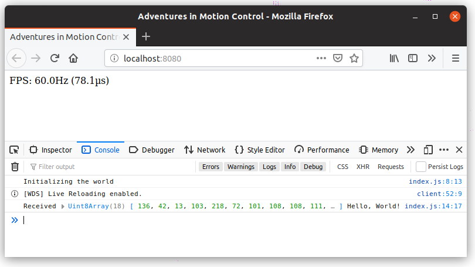
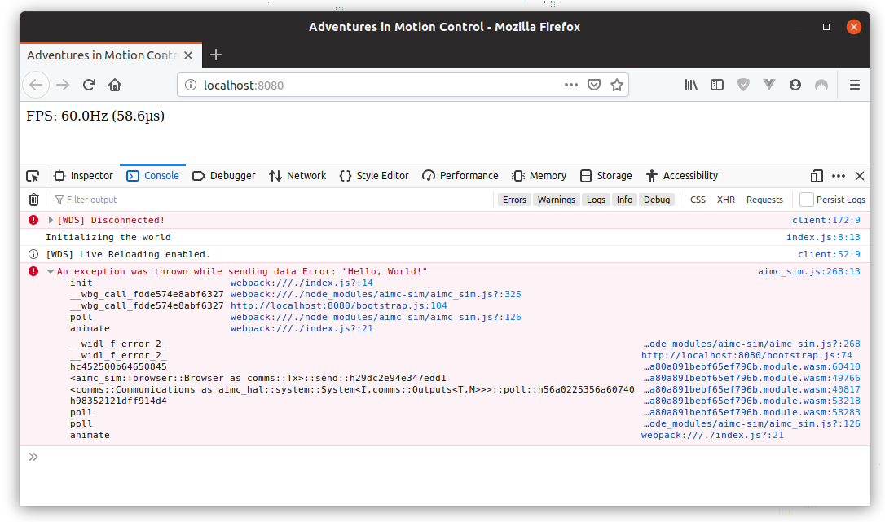

Now we have a mechanism for transferring bytes from the frontend to the
simulator and back again, we need to translate those bytes into higher-level
messages. Luckily each [`anpp::Packet`] contains an [`ID` field][packet-id] that
is designed specifically for this purpose.

That lets us do something like this:

```rust
// (not real code)

enum Message<'a> {
    Ping,
    StatusCheck,
    ProgramChunk {
        chunk_number: usize,
        body: &'a [u8],
    },
    ...
}

struct UnknownMessageError;

fn parse_packet<'a>(pkt: &'a Packet) -> Result<Message<'a>, UnknownMessageError> {
    match pkt.id() {
        0 => Ok(Message::Ping),
        1 => Ok(Message::StatusCheck),
        2 => Ok(...),
        _ => Err(UnknownMessageError),
    }
}
```

The top-level `App` can handle messages by routing them to the appropriate 
system and invoking a message handler.

## Message Routing

A `Router` contains references to the various other systems, implementing
`MessageHandler` and delegating the handling of a message to the corresponding
system.

This design makes use of references to avoid the need for `Rc` and friends,
while taking advantage of lifetimes and the ability to pass out `&mut` 
references to different fields of a struct at the same time.

```rust
// sim/src/router.rs

use anpp::Packet;
use comms::{CommsError, MessageHandler};
use fps_counter::FpsCounter;

pub(crate) struct Router<'a> {
    pub(crate) fps: &'a mut FpsCounter,
}

impl<'a> MessageHandler for Router<'a> {
    fn handle_message(&mut self, msg: &Packet) -> Result<Packet, CommsError> {
        match msg.id() {
            _ => Err(CommsError::UnknownMessageType),
        }
    }
}
```

To start using the `Router` we need to add the `Communications` system to our
`App`.

```rust
// sim/src/app.rs

#[wasm_bindgen]
#[derive(Debug)]
pub struct App {
    ...
    comms: Communications,
}

impl App {
    pub fn new(inputs: Inputs, browser: Browser) -> App {
        let fps = FpsCounter::default();
        let comms = Communications::new();
        App { inputs, browser, fps, comms }
    }

    pub fn poll(&mut self) {
        self.inputs.begin_tick();

        self.handle_comms(); // <-- new
        self.fps.poll(&self.inputs, &mut self.browser);
    }

    fn handle_comms(&mut self) {
        let mut router = Router { fps: &mut self.fps };
        let mut outputs = comms::Outputs::new(&mut self.browser, &mut router);
        self.comms.poll(&self.inputs, &mut outputs);
    }
}
```

At this point the compiler is complaining that `Browser` doesn't implement the
`comms::Tx` trait (for sending bytes to the UI). We'll come back to this later,
so for now just leave it `unimplemented!()`.

<a name="earlier-unimplemented"></a>

```rust
// sim/src/browser.rs

impl Tx for Browser {
    fn send(&mut self, _packet: Packet) { unimplemented!() }
}
```

## Making Sense of Messages

At the moment the only other system is the `FpsCounter`, so lets create a 
request for clearing the counter.

In the long term we'd like to make adding a new message type and handling it as
simple as possible. Ideally just a case of adding the message and response types
(with derives for serializing/deserializing), implementing `Handle` so the 
system can handle the message, then adding a new arm to `Router`'s match 
statement.

```rust
// in the my_system module

#[derive(ParseFromPacket)]
struct SomeMessage { ... }

#[derive(EncodeAsPacket)]
struct SomeResponse { ... }

impl Handler<SomeMessage> for MySystem {
    fn handle(&mut self, msg: SomeMessage) -> SomeResponse {
        ...
    }
}

// then in the router

impl<'a> MessageHandler for Router<'a> {
    fn handle_message(&mut self, msg: &Packet) -> Result<Packet, CommsError> {
        match msg.id() {
            ...
            // associate this message with an ID of 42, parse the raw bytes to
            // SomeMessage, make sure my_system handles it, then turn the 
            // response into a Packet so we can send it to the serial port
            42 => dispatch(&mut self.my_system, msg.content()),
            ...
            _ => Err(CommsError::UnknownMessageType),
        }
    }
}
```

For serializing and deserializing we can use the [scroll][scroll] crate. This
gives us a nice `#[derive]` for copying the contents of a struct directly to
a byte buffer. Something that's very common in C programming, and boils down to
a couple calls to `memcpy()`. 

{}
As a bonus, this sort of encoding makes troubleshooting communications
problems with real hardware really easy. Because we're not playing around
with things like compression or variable-length integers, you can watch the
bytes go back and forth using [Wireshark][ws], mentally translating from
binary to the integers and strings that make up a message.

[ws]: https://www.wireshark.org/
{}

First we'll create the `Handler` trait.

```rust
// hal/src/messaging.rs

use anpp::Packet;

/// Something which can handle a request and generate a response.
pub trait Handler<M> {
    /// The type of response.
    type Response;

    fn handle(&mut self, msg: M) -> Self::Response;
}

/// Acknowledge a request without returning any extra information.
#[derive( 
    Debug, Default, Copy, Clone, PartialEq, Eq, Pread, Pwrite, IOread, IOwrite, 
    SizeWith,
)]
pub struct Ack {}

impl Ack {
    /// The ID used when encoded as a [`Packet`].
    pub const ID: u8 = 0;

    pub fn new() -> Ack { Ack::default() }
}

impl From<Ack> for Packet {
    fn from(_: Ack) -> Packet { Packet::new(Ack::ID) }
}
```

Now we can create a `Clear` message and give `FpsCounter` a way to handle it.

```rust
// fps_counter/src/lib.rs

/// Clear the buffer used when [`FpsCounter`] calculates its rolling average.
#[derive(Pread, Pwrite, IOread, IOwrite, SizeWith)]
struct Clear {}

impl Handler<Clear> for FpsCounter {
    type Response = Ack;

    fn handle(&mut self, _msg: Clear) -> Self::Response {
        self.ticks.clear();
        Ack::new()
    }
}
```

We can now add the match arm to our `Router`'s `handle_message()` method.

```rust
// sim/src/router.rs

use fps_counter::Clear;

impl<'a> MessageHandler for Router<'a> {
    fn handle_message(&mut self, msg: &Packet) -> Result<Packet, CommsError> {
        match msg.id() {
            1 => dispatch::<_, Clear>(self.fps, msg.contents()),
            _ => Err(CommsError::UnknownMessageType),
        }
    }
}
```

The only thing missing is that `dispatch()` function. That's where the magic
really happens. Unfortunately due to the highly generic nature of what we're
trying to do the signature is a bit gnarly...

```rust
// sim/src/router.rs

/// Parse a message using [`scroll`] and send it to some [`Handler`], turning
/// the response back into an ANPP [`Packet`].
fn dispatch<'a, H, M>(
    handler: &mut H,
    raw_msg: &'a [u8],
) -> Result<Packet, CommsError>
where
    // M, our message, should be parseable from a slice of bytes (which we can
    // index into using `usize`). We're also explicitly specifying the 
    // endianness
    M: TryFromCtx<'a, scroll::Endian, Size = usize>,
    // pread_with() will automatically translate parsing failures from a generic
    // scroll error to our message's error type
    M::Error: From<scroll::Error>,
    // H should be able to handle the message
    H: Handler<M>,
    // then the response can be turned into a packet
    H::Response: Into<Packet>,
{
    let msg: M = raw_msg
        .pread_with(0, scroll::NETWORK)
        .map_err(|_| CommsError::ParseFailed)?;

    let response = handler.handle(msg);

    Ok(response.into())
}
```

That little incantation completes the guts of the `Router` type. This 
infrastructure gives our application a well-defined mechanism for transferring
data between the frontend and the motion controller. 

It also simplifies the process of adding new requests and responses as the 
application evolves.

## Actually Sending Some Data

You may have noticed that [earlier](#earlier-unimplemented) we "implemented"
the `Tx` trait for `Browser` with `unimplemented!()`, leaving the process of
sending data to the frontend for later. Well now is later.

Transferring data to the frontend is done by registering a JavaScript callback
with the `Browser` (via a `#[wasm_bindgen]` method on `App`) and calling it
with a [`Uint8Array`][uint8-array] as the only argument.

```rust
// sim/src/browser.rs

use js_sys::{Function, Uint8Array};

#[derive(Debug, Clone)]
pub struct Browser {
    fps_div: Element,
    tx: Option<Function>,
}

impl Browser {
    pub fn from_element(fps_selector: &str) -> Result<Browser, &'static str> {
        ...

        Ok(Browser {
            fps_div: element,
            tx: None,
        })
    }
}

impl Tx for Browser {
    fn send(&mut self, data: &[u8]) {
        if let Some(ref tx) = self.tx {
            // efficiently create a typed array directly from WASM memory
            let buffer = Uint8Array::from(data);

            // then try to invoke the callback
            let outcome = tx.call1(&JsValue::NULL, &buffer);

            if let Err(e) = outcome {
                let msg =
                    JsValue::from("An exception was thrown while sending data");
                web_sys::console::error_2(&msg, &e);
            }
        }
    }
}
```

We also need to provide a couple setters so JavaScript can register this 
callback.

```rust
// sim/src/browser.rs

impl Browser {
    ...

    pub(crate) fn set_data_sent(&mut self, callback: Function) {
        self.tx = Some(callback);
    }
}

// sim/src/app.rs

#[wasm_bindgen]
impl App {
    ...

    /// Set the callback to be invoked whenever the simulator wants to send data
    /// to the frontend.
    /// 
    /// The callback will be passed a [`Uint8Array`] as the first argument.
    pub fn on_data_sent(&mut self, callback: Function) {
        self.browser.set_data_sent(callback);
    }
}
```

Next we need to register our callback from the `init()` function in `index.js`.
Later on we'll add a more realistic handler, but we'll use `console.log()` 
temporarily to see what's going on.

```js
// frontend/index.js

function init() {
    console.log("Initializing the world");
    world = wasm.setup_world("#fps-counter");
    world.on_data_sent(data => {
        const str = new TextDecoder("utf-8").decode(data.slice(5));
        console.log("Received", data, str);
    });
    requestAnimationFrame(animate);
}
```

{}
Remember that the first 5 bytes of an ANPP message are the header. We use 
`data.slice(5)` to skip the first 5 bytes and then interpret the rest as a UTF-8 
string using a `TextDecoder`.
{}

Lets tell the router to handle a message with ID 42 by returning the original
message unchanged (i.e. its an `echo` command).

```rust
// sim/src/router.rs

impl<'a> MessageHandler for Router<'a> {
    fn handle_message(&mut self, msg: &Packet) -> Result<Packet, CommsError> {
        match msg.id() {
            1 => dispatch::<_, Clear>(self.fps, msg.contents()),
            // echo
            42 => Ok(msg.clone()),
            _ => Err(CommsError::UnknownMessageType),
        }
    }
}
```

We should also expose a helper method on `App` for generating an `echo` message
and sending it to the backend. Remember that sending a message is asynchronous
(it *won't* block) and the callback registered with `on_data_sent()` will only
be invoked the next time `requestAnimationFrame()` runs.

```rust
// sim/src/app.rs

#[wasm_bindgen]
impl App {
    ...

    /// Sends the backend a message (via [`App::on_data_received()`]) to echo
    /// back a string of text.
    pub fn echo(&mut self, text: &str) -> Result<(), JsValue> {
        let pkt = Packet::with_data(42, text.as_bytes())
            .map_err(|_| "The input text is too long")?;

        let mut buffer = [0; Packet::MAX_PACKET_SIZE + 5];
        let bytes_written = pkt
            .write_to_buffer(&mut buffer)
            .map_err(|_| "Unable to write the packet to a buffer")?;

        self.on_data_received(&buffer[..bytes_written]);

        Ok(())
    }
}
```

Finally, we'll register an `echo` to be sent about 500ms after initializing the
world.

```js
// frontend/index.js

function init() {
    ...

    setTimeout(() => world.echo("Hello, World!"), 500);
}
```

Surprisingly, reloading the *Adventures in Motion Control* tab and opening the
dev console shows everything worked first time!



While we're at it, let's make sure throwing an exception in the callback doesn't
break the world.

```js
// frontend/index.js

function init() {
    ...

    world.on_data_sent(data => {
        const str = new TextDecoder("utf-8").decode(data.slice(5));
        throw new Error(str);
    });
}
```

The `<Browser as Tx>::send()` method will invoke `console.error()` whenever the
callback returns an `Err` (`wasm_bindgen` generates shims to turn exceptions 
into a `Result<T, JsValue>`), so in theory it should show in the dev tools 
window with a backtrace.



The backtrace isn't stellar, but it's definitely usable. 

If you know how to set up source maps or some other tool for translating those
opaque WASM offsets into file names and line numbers, let me know!

[packet-id]: https://docs.rs/anpp/1.0.1/anpp/struct.Packet.html#method.id
[scroll]: https://crates.io/crates/scroll
[uint8-array]: https://docs.rs/js-sys/0.3.27/js_sys/struct.Uint8Array.html