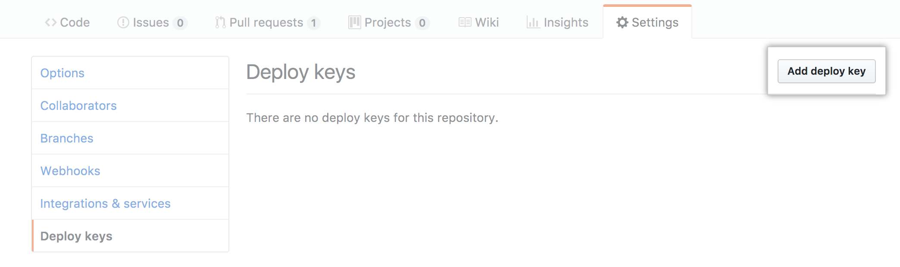
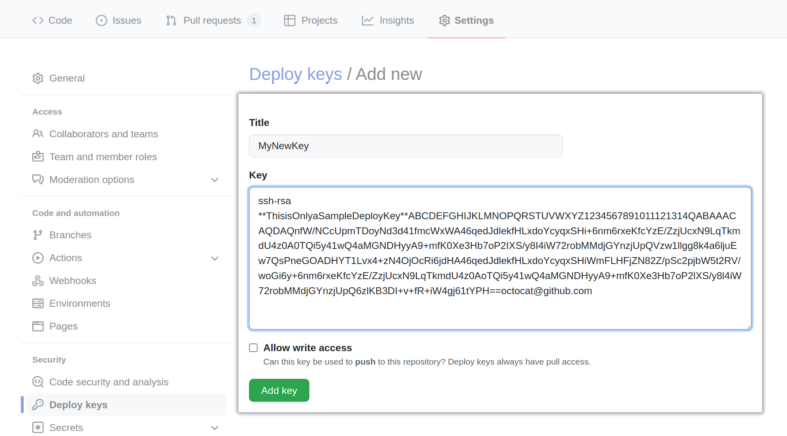
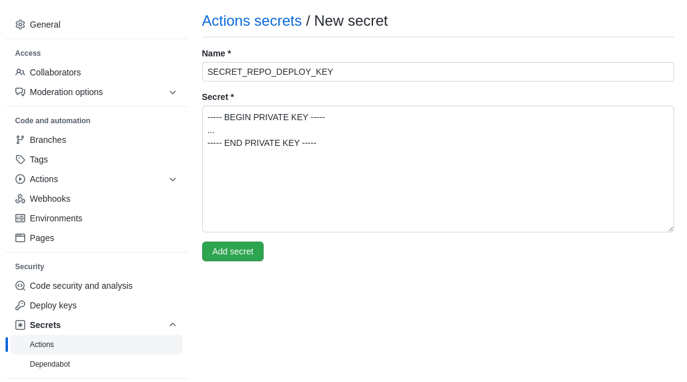

When developing locally, you can add a private GitHub repository to your Rust
crate as a `git` repository and `cargo` should be able to retrieve it just fine.

However, GitHub Actions will probably run into authentication issues when trying
to build your crate. The error message will look something like this:

```shell
$ cargo check --workspace --verbose --locked
 Updating git repository `https://github.com/Michael-F-Bryan/my-secret-repo.git`
 Running `git fetch --force --update-head-ok 'https://github.com/Michael-F-Bryan/my-secret-repo.git' '+HEAD:refs/remotes/origin/HEAD'`
Error: failed to get `webc` as a dependency of package `wit-pack-cli v0.1.4 (/home/runner/work/wit-pack/wit-pack/crates/cli)`
Caused by:
 failed to load source for dependency `webc`

Caused by:
 Unable to update https://github.com/Michael-F-Bryan/my-secret-repo.git

Caused by:
 failed to clone into: /home/runner/.cargo/git/db/my-secret-repo-20c1af0756e23bf7

Caused by:
 process didn't exit successfully: `git fetch --force --update-head-ok 'https://github.com/Michael-F-Bryan/my-secret-repo.git' '+HEAD:refs/remotes/origin/HEAD'` (exit status: 128)
 --- stderr
 fatal: could not read Username for 'https://github.com': No such device or address
Error: The process '/home/runner/.cargo/bin/cargo' failed with exit code 101
```

This happens because the user on your dev machine is associated with a
particular GitHub account and that account has access to the repository, whereas
the GitHub Actions user can only see the repository it's attached to.

The *Cargo Book* has a chapter on [*Git Authentication*][git-auth], but the
*HTTPS Authentication* method they suggest (using credential stores) stopped
working in August 2021 when [GitHub shut down password authentication][password-auth-announcement].

Nowadays, the best way to authenticate with GitHub is via
[*Deploy Keys*][deploy-keys]. This is a set of SSH keys that will give users
read-only access (by default) to a particular repository.

{}
If you found this useful or spotted a bug in the article, let me know on the
blog's [issue tracker][issue]!

[issue]: https://github.com/Michael-F-Bryan/adventures.michaelfbryan.com/issues
{}

## Generate Deploy Keys

First, we'll need to generate a set of SSH keys that we can use.

```console
$ ssh-keygen -t rsa -b 4096 -C "consulting@michaelfbryan.com"
```

{}
If you are using 1Password to share secrets with co-workers, you can use its
[builtin support](https://developer.1password.com/docs/ssh/manage-keys/#generate-an-ssh-key)
for SSH keys to generate the key and save it with one click.
{}

{}
 Make sure you generate a RSA key

 When I generated an `ed25519` key, the `ssh-add` on GitHub Actions rejected it with this error message:

 ```
 Adding GitHub.com keys to /home/runner/.ssh/known_hosts
 Starting ssh-agent
 SSH_AUTH_SOCK=/tmp/ssh-M5otljx2VjtQ/agent.1637
 SSH_AGENT_PID=1638
 Adding private key(s) to agent
 Error loading key "(stdin)": invalid format
 Error: Command failed: ssh-add -
 Error loading key "(stdin)": invalid format
 ```

 [According to Stack Overflow](https://serverfault.com/a/1027037), this appears to be an issue with OpenSSH 8.3.
 {}

## Uploading the Deploy Key

Now we need to add the **public** key as a deploy key to the repository we want
access to (`Michael-F-Bryan/my-secret-repo` in this case). GitHub's website has
[some docs][deploy-keys] for this, but the process is pretty simple.

I won't bore you with instructions, so here are some screenshots.





## Adding it to GitHub Secrets

If our project wants access to this private repository, we'll need to give it
the private half of our deploy key to use.

We do this by adding the **private** key to our repository as a secret called
`SECRET_REPO_DEPLOY_KEY`.



{}
If multiple projects will need access to this private repository, you might
want to add it as a secret on the *Organisation* level. That should make it a
lot easier to manage.
{}

## Updating the Source Code

Now we've set up the deploy keys, it's time to use them.

First, add the dependency using its `ssh` URL.

```toml
# Cargo.toml
[dependencies]
webc = { git = "ssh://git@github.com/Michael-F-Bryan/my-secret-repo.git", ... }
```

We need to make sure GitHub Actions uses the deploy key that we're setting up,
so we can use the
[`webfactory/ssh-agent`](https://github.com/marketplace/actions/webfactory-ssh-agent)
action to load it into `ssh-agent`.

```yml
# .github/workflows/ci.yml
jobs:
  compile-and-test:
    ...
    steps:
    ...
    - name: Give GitHub Actions access to Michael-F-Bryan/my-secret-repo
      uses: webfactory/ssh-agent@v0.5.4
      with:
        ssh-private-key: ${{ secrets.SECRET_REPO_DEPLOY_KEY }}
```

This can be done manually as well, but it [requires a couple extra
steps](https://www.webfactory.de/blog/use-ssh-key-for-private-repositories-in-github-actions).

That's all you should need, so you can commit and push to GitHub now.

Good Luck 🙂

[git-auth]: https://doc.rust-lang.org/cargo/appendix/git-authentication.html
[password-auth-announcement]: https://github.blog/changelog/2021-08-12-git-password-authentication-is-shutting-down/
[deploy-keys]: https://docs.github.com/en/developers/overview/managing-deploy-keys#deploy-keys
