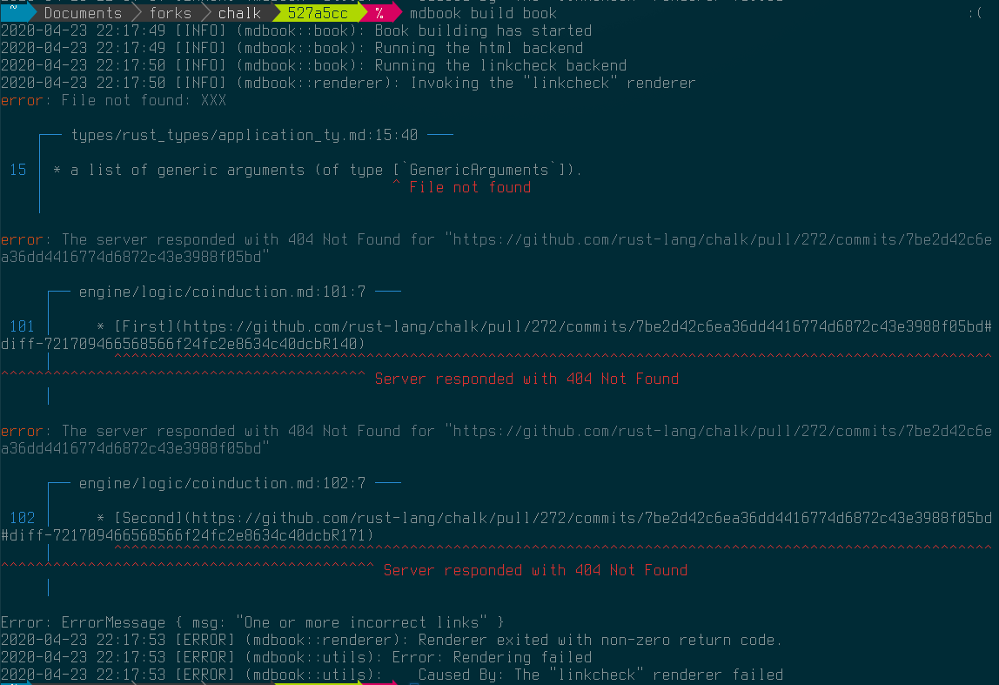

With around 63,544 downloads, one of my most successful Rust projects is a
nondescript little program called [mdbook-linkcheck][mdbook-linkcheck]. This
is a link-checker for [mdbook][mdbook], the tool powering a lot of
documentation in the Rust community, including [*The Rust Programming
Language*][trpl] and [*The Rustc Dev Book*][rustc-dev].

As an example of what it looks like, I recently found [a couple][pr-408]
broken links in [the documentation][chalk-book] for Chalk. When the tool
detects broken links in your markdown it'll emit error messages that point
you at the place the link is defined and explain what the issue is.



This tool has been around for a while and works quite well, so when I was
fixing a bug the other day I decided it's about time to extract the core logic
into a standalone library that others can use.

{}
The code written in this article is available [on GitHub][repo] and published
[on crates.io][crate]. Feel free to browse through and steal code or
inspiration.

If you found this useful or spotted a bug, let me know on the blog's
[issue tracker][issue]!

[crate]: https://crates.io/crates/linkcheck
[repo]: https://github.com/Michael-F-Bryan/linkchecker
[issue]: https://github.com/Michael-F-Bryan/adventures.michaelfbryan.com
{}

## What Belongs in a Library?

When you start building a library it's good to think about what problem the
library is trying to solve. That way you know what features belong in the
library and, more importantly, what doesn't.

The [`linkchecker`][crate] crate's primary objective is to find links in a
document and check that they point to something valid. There seem to be two
concepts here:

- `Scanner` - some sort of function which can consume text and return a stream
  of links that are found.
- `Validator` - something which can take a batch of links and tell you whether
  they are valid or not

{}
For diagnostic purposes we'll also want to know *where* each link occurs in
the source document. So instead of just being a `String`, a link will need to
drag its `Span` along with it.

The [`codespan`][codespan] crate contains a lot of powerful tools for
managing source code and emitting diagnostics, so I imagine I'll be leaning
on it quite a bit.

[codespan]: https://crates.io/crates/codespan
{}

In the long run, it'd be nice to include scanners for most popular formats,
however to keep things manageable I'm going to constrain this to plain text
and markdown for now. I imagine HTML would also be a nice addition because
it'll let people check their websites, but I'll leave that as an exercise for
later.

As far as I can tell, there are only really two types of links,

- *Local Files* - a link to another file on disk
- *Web Links* - a URL for some resource on the internet

Validating web links should be rather easy, we can send a GET request to the
appropriate website and our web client (probably [`reqwest`][reqwest]) will let
us know if we've got a dead link or not.

## Extracting Links from Plain Text

I thought I'd start with plain text because that's easiest. We want to create
some sort of iterator which yields all the bits of text that resemble a URL.

Originally I thought it'd just be a case of writing a regular expression and
mapping the [`Matches`][regex::Matches] iterator from the [`regex`][regex]
crate, but it turns out URLs aren't that easy to work with.

After searching google for about 10 minutes and scanning through dozens of
StackOverflow questions I wasn't able to find an expression which would match
*all* the types of URLs I expected while also avoiding punctuation like a
trailing full stop or when a link is in parentheses, and detecting links
don't have a scheme (e.g. `./README.md` instead of `file:///README.md`).

This reminds me of a popular quote...

> Some people, when confronted with a problem, think *"I know, I'll use
> regular expressions."* Now they have two problems.
>
> <cite>Jamie Zawinski</cite>

Luckily for me, this problem has [already been solved][linkify-repo] and [the
`linkify` crate][linkify] is available on crates.io!

Looking through the source code, it seems like they've written a lot of
manual code to take into account how URLs may be embedded in bodies of text.
This mainly consists of scanning for certain "trigger characters" (`:` for a
URL, `@` for an email address) then backtracking to find the start of the
item. There are also [lots of tests][linkify-tests] to make sure only the
desired text is detected as a match.

The end result means the implementation of our `plaintext` scanner is almost
trivial:

```rust
// src/scanners/plaintext.rs

use crate::codespan::Span;
use linkify::{LinkFinder, LinkKind};

pub fn plaintext(src: &str) -> impl Iterator<Item = (&str, Span)> + '_ {
    LinkFinder::new()
        .kinds(&[LinkKind::Url])
        .links(src)
        .map(|link| {
            (
                link.as_str(),
                Span::new(link.start() as u32, link.end() as u32),
            )
        })
}
```

I also threw in tests for a couple examples:

```rust
// src/scanners/plaintext.rs

#[cfg(test)]
mod tests {
    use super::*;

    #[test]
    fn detect_urls_in_some_text() {
        let src = "hello http://localhost/ world. this is file://some/text.";
        let should_be = vec![
            ("http://localhost/", Span::new(6, 23)),
            ("file://some/text", Span::new(39, 55)),
        ];

        let got: Vec<_> = plaintext(src).collect();

        assert_eq!(got, should_be);
    }
}
```

## Extracting Links from Markdown

For parsing markdown my go-to library is [`pulldown-cmark`][pulldown-cmark].
This exposes an iterator-based API, yielding `Event`s like *"start of
paragraph tag"*, *"end of inline code"*, *"horizontal rule"*, and so on.

This API is pretty low level and you'll need to do a lot of work yourself if
you want to create some sort of semantic model (e.g. a DOM) of the document,
but if you're just wanting to scan through a document and extract specific
bits like we are, it's ideal.

The `pulldown-cmark` parser also provides an ["offset"
iterator][pulldown-offset-iter] who's `Item` is a `(Event<'a>,
Range<usize>)`. This should give us enough information to provide developers
with useful diagnostics.

My initial `markdown` scanner looked something like this:

```rust
// src/scanners/markdown.rs

pub fn markdown(src: &str) -> impl Iterator<Item = (String, Span)> + '_ {
    Parser::new(src)
    .into_offset_iter()
    .filter_map(|(event, range)| match event {
        Event::Start(Tag::Link(_, dest, _))
        | Event::Start(Tag::Image(_, dest, _)) => Some((
            dest.to_string(),
            Span::new(range.start as u32, range.end as u32),
        )),
        _ => None,
    })
}
```

The chain of iterator combinators and `match` statement make the code look
complicated, the idea itself is quite simple... Filter out everything but the
start of `Link` and `Image` tags, then transform them to a tuple containing
the link itself and its location in the source text.

The `pulldown-cmark` parser also lets you provide a callback that can will be
triggered whenever it encounters a footnote-style link (e.g. `[some
text][link]`) with no corresponding link definition (e.g. `[link]:
https://example.com`). This is normally meant as a mechanism for *fixing* the
broken reference, but we can use it to emit diagnostics.

The updated scanner:

```rust
// src/scanners/markdown.rs

use crate::codespan::Span;
use pulldown_cmark::{Event, Options, Parser, Tag};

pub fn markdown(src: &str) -> impl Iterator<Item = (String, Span)> + '_ {
    markdown_with_broken_link_callback(src, &|_, _| None)
}

pub fn markdown_with_broken_link_callback<'a, F>(
    src: &'a str,
    on_broken_link: &'a F,
) -> impl Iterator<Item = (String, Span)> + 'a
where
    F: Fn(&str, &str) -> Option<(String, String)>,
{
    Parser::new_with_broken_link_callback(
        src,
        Options::ENABLE_FOOTNOTES,
        Some(on_broken_link),
    )
    .into_offset_iter()
    .filter_map(|(event, range)| match event {
        Event::Start(Tag::Link(_, dest, _))
        | Event::Start(Tag::Image(_, dest, _)) => Some((
            dest.to_string(),
            Span::new(range.start as u32, range.end as u32),
        )),
        _ => None,
    })
}
```

{}
Unfortunately, the `on_broken_link` callback doesn't provide span information
so that'll make it a bit tricky to provide useful error messages.

I had to deal with this in `mdbook-linkcheck` as well and ended up using [a
hacky workaround][hack] consisting of a call to
`src.index_of(broken_reference)` and hoping for the best.

Hopefully [raphlinus/pulldown-cmark#165][pd-cmark-165] will be solved some
time soon and they'll change the signature to something more useful, because
it's kinda clunky at the moment. I've seen at least [one case][issue-478]
where these sorts of broken links occur in real world documents, so it'd be
nice to have a solid solution.

[hack]: https://github.com/Michael-F-Bryan/mdbook-linkcheck/blob/d39af0a48ce8b83db1e54f723d994258689f825a/src/validate.rs#L317-L332
[pd-cmark-165]: https://github.com/raphlinus/pulldown-cmark/issues/165
[issue-478]: https://github.com/rust-lang/rustc-dev-guide/issues/478
{}

By now you've probably identified a pattern with implementing scanners.

Basically,

1. Find a crate that already exists
2. let them do the hard work of parsing your document
3. do a bit of post-processing to extract just the bits we care about

## Validating Links to Local Files

The main reason we want to check links to other local files is for
documentation tools like [`mdbook`][mdbook]. This is where several markdown
files exist in a directory tree, and they will be compiled to HTML that
maintains the same tree structure.

### Constraints

It's important to re-state this mdbook-specific aspect because it adds a couple
interesting constraints to the problem...

1. You can write a link to a directory (e.g. `/foo/`) and the browser will
   fall back to a default path (e.g. `/foo/index.html`)
2. There is the concept of a "root directory" which the document will be served
   from, and any absolute links (i.e. a link starting with a `/`) should be
   relative to this directory
3. We want to control whether links can go outside the root directory (e.g.
   `../../../../etc/passwd`) for security reasons and because these sorts of
   links make assumptions about the environment which may not always be true
   (e.g. the relative location of two repositories on disk)

These constraints are encapsulated in our `Options` type:

```rust
// src/validation/filesystem.rs

use std::{ffi::OsString, path::PathBuf};

pub struct Options {
    root_directory: Option<PathBuf>,
    default_file: OsString,
    links_may_traverse_the_root_directory: bool,
}

impl Options {
    pub const DEFAULT_FILE: &'static str = "index.html";

    pub fn new() -> Self {
        Options {
            root_directory: None,
            default_file: OsString::from(Options::DEFAULT_FILE),
            links_may_traverse_the_root_directory: false,
        }
    }
}
```

(The type also has several getters and setters, but they are largely irrelevant
for our purposes)

The first big operation that we can do with `Options` is to "join" a directory
and a link. This reduces to a `current_dir.join(second)` in the simplest case,
but we need to do some fancy logic when the link is absolute.

```rust
// src/validation/filesystem.rs

impl Options {
    fn join(
        &self,
        current_dir: &Path,
        second: &Path,
    ) -> Result<PathBuf, Reason> {
        if second.is_absolute() {
            // if the path is absolute (i.e. has a leading slash) then it's
            // meant to be relative to the root directory, not the current one
            match self.root_directory() {
                Some(root) => {
                    let mut buffer = root.to_path_buf();
                    // append everything except the root element
                    buffer.extend(second.iter().skip(1));
                    Ok(buffer)
                },
                // You really shouldn't provide links to absolute files on your
                // system (e.g. "/home/michael/Documents/whatever" or
                // "/etc/passwd").
                //
                // For one, it's extremely brittle and will probably only work
                // on that computer, but more importantly it's also a vector
                // for directory traversal attacks.
                //
                // Feel free to send a PR if you believe otherwise.
                None => Err(Reason::TraversesParentDirectories),
            }
        } else {
            Ok(current_dir.join(second))
        }
    }
}
```

The next big operation is path canonicalisation. This is where we convert the
joined path to its canonical form, resolving symbolic links and `..`s
appropriately. As a side-effect of canonicalisation, the OS will also return a
`FileNotFound` error if the item doesn't exist.

```rust
// src/validation/filesystem.rs

impl Options {
    fn canonicalize(&self, path: &Path) -> Result<PathBuf, Reason> {
        let mut canonical = path.canonicalize()?;

        if canonical.is_dir() {
            canonical.push(&self.default_file);
            // we need to canonicalize again because the default file may be a
            // symlink, or not exist at all
            canonical = canonical.canonicalize()?;
        }

        Ok(canonical)
    }
}
```

We also need to do a quick sanity check to make sure links don't escape the
"root" directory unless explicitly allowed.

```rust
// src/validation/filesystem.rs

impl Options {
    fn sanity_check(&self, path: &Path) -> Result<(), Reason> {
        if let Some(root) = self.root_directory() {
            if !(self.links_may_traverse_the_root_directory || path.starts_with(root))
            {
                return Err(Reason::TraversesParentDirectories);
            }
        }

        Ok(())
    }
}
```

### Resolving File System Links

Now we've encoded our constraints in the `Options` type, we can wrap all this
code up into a single function. This function will take a "link" and tries to
figure out which file is being linked to.

```rust
// src/validation/filesystem.rs

pub fn resolve_link(
    current_directory: &Path,
    link: &Path,
    options: &Options,
) -> Result<PathBuf, Reason> {
    let joined = options.join(current_directory, link)?;

    let canonical = options.canonicalize(&joined)?;
    options.sanity_check(&canonical)?;

    // Note: canonicalizing also made sure the file exists
    Ok(canonical)
}
```

As a side note, we use the [`thiserror`][thiserror] crate to simplify the
boilerplate around defining the reason that validation may fail, `Reason`. Our
`Reason` type is just an enum of the different reasons that validation may fail.

```rust
// src/validation/mod.rs

/// Possible reasons for a bad link.
#[derive(Debug, thiserror::Error)]
#[non_exhaustive]
pub enum Reason {
    #[error("Linking outside of the book directory is forbidden")]
    TraversesParentDirectories,
    #[error("An OS-level error occurred")]
    Io(#[from] std::io::Error),
    #[error("The web client encountered an error")]
    Web(#[from] reqwest::Error),
}

impl Reason {
    pub fn file_not_found(&self) -> bool {
        match self {
            Reason::Io(e) => e.kind() == std::io::ErrorKind::NotFound,
            _ => false,
        }
    }

    pub fn timed_out(&self) -> bool {
        match self {
            Reason::Web(e) => e.is_timeout(),
            _ => false,
        }
    }
}
```

### Wrapping It Up in a Check

The whole point of this endeavour is to have some sort of validation function
which takes a link to a local file and makes sure it's valid.

For this, I'm going to introduce the idea of a validator context. This is a
collections of useful properties and callbacks to help guide the validation
process.

At the moment we only need access to the file system validator's `Options`, so
the `Context` trait looks a little bare.

```rust
// src/validation/mod.rs

pub trait Context {
    /// Options to use when checking a link on the filesystem.
    fn filesystem_options(&self) -> &Options;
}
```

Now we need to wrap our `resolve_link()` in a `check_filesystem()` function
which uses the `Context`

```rust
// src/validation/filesystem.rs

use crate::validation::Context;

/// Check whether a [`Path`] points to a valid file on disk.
///
/// If a fragment specifier is provided, this function will scan through the
/// linked document and check that the file contains the corresponding anchor
/// (e.g. markdown heading or HTML `id`).
pub fn check_filesystem<C>(
    current_directory: &Path,
    path: &Path,
    fragment: Option<&str>,
    ctx: &C,
) -> Result<(), Reason>
where
    C: Context,
{
    log::debug!(
        "Checking \"{}\" in the context of \"{}\"",
        path.display(),
        current_directory.display()
    );

    let resolved_location = resolve_link(
        current_directory,
        path,
        ctx.filesystem_options(),
    )?;

    log::debug!(
        "\"{}\" resolved to \"{}\"",
        path.display(),
        resolved_location.display()
    );

    if let Some(fragment) = fragment {
        // TODO: detect the file type and check the fragment exists
        log::warn!(
            "Not checking that the \"{}\" section exists in \"{}\" because fragment resolution isn't implemented",
            fragment,
            resolved_location.display(),
        );
    }

    Ok(())
}
```

The code isn't overly exciting, it boils down to a bunch of log statements and
returns a `()` instead of `PathBuf` to indicate we don't care about the result
of a successful check.

{}
You may have noticed there's this new `fragment` parameter and a big `TODO`
comment when one is provided.

The idea is that sometimes we won't *just* have a link to some document (e.g.
`../index.md`) and will want to link to a particular part of the document. In
HTML this is often done using a [fragment identifier][id], the `some-heading`
part in `../index.md#some-heading`.

I'm not really sure how I'll implement this one. Different document types
will implement *fragment identifiers* in different ways, so I'd probably need
to check the linked file's mime-type and search for an element with a
`id="some-heading"` attribute in HTML, or a markdown heading who's
[slug][slug] looks something like `some-heading`... That sounds a bit fiddly,
so I'm going to skip it for now.

[id]: https://en.wikipedia.org/wiki/Fragment_identifier
[slug]: https://en.wikipedia.org/wiki/Clean_URL#Slug
{}

## Validating Links on the Web

## What Colour is Your Function?

When I was originally developing [`mdbook-linkcheck`][mdbook-linkcheck] the
only real option was to use synchronous IO for validating everything (i.e.
local files and remote links on the web), implementing parallelism with
OS-level threads via [`rayon`][rayon]. However, in the last 12 months or so
Rust has made massive strides towards making asynchronous IO a first-class
citizen in the ecosystem.

This is awesome, but now I've got a choice to make... Should the link-checker
leverage asynchronous IO to get cheap performance improvements when going over
the internet, or should we stick with the existing (synchronous) solution?

There's this interesting article on the topic titled [*"What Colour is Your
Function?"*][function-colour], if you haven't already, I'd suggest giving it a
read.

In the article, *Bob Nystrom* discusses a hypothetical language with the
following peculiarities:

1. Every function has a colour - each function **must** be coloured either
   *Red* or *Blue*
2. The way you call a function depends on its colour - imagine they use
   different syntax or something
3. You can only call a red function from within another red function
4. Red functions are more painful to call
5. Some core library functions are red

The author follows these rules through and compares them to the sync/async
divide in well-known languages like C#, JavaScript, and Python.

> For example, let’s say we have a nice little blob of code that, I don’t
> know, implements Dijkstra’s algorithm over a graph representing how much your
> social network are crushing on each other. (I spent way too long trying to
> decide what such a result would even represent. Transitive undesirability?)
>
> Later, you end up needing to use this same blob of code somewhere else. You
> do the natural thing and hoist it out into a separate function. You call it
> from the old place and your new code that uses it. But what colour should it
> be? Obviously, you’ll make it blue if you can, but what if it uses one of
> those nasty red-only core library functions?
>
> What if the new place you want to call it is blue? You’ll have to turn it
> red. Then you’ll have to turn the function that calls it red. Ugh. No matter
> what, you’ll have to think about colour constantly. It will be the sand in
> your swimsuit on the beach vacation of development.

Now imagine synchronous code is blue and asynchronous code is red.

If I want to use async-await for some of my validators (because it'll
drastically improve throughput when checking links on the web) then all the
other validation machinery will need to be async too. Not only that, but
anyone that wants to use my `linkcheck` crate will *also* need to opt-in to
async. Asynchrony is contagious like that.

It also doesn't help that [`tokio`][tokio] and [`hyper`][hyper] (the
fundamental crates most async web clients are built on top of) pull in a
*lot* of transitive dependencies and can have a massive impact on compilation
times.

<!--
    FIXME: Should I remove this entire section? It feels like rambling and
    doesn't really have a firm direction...
-->

## Conclusions

[mdbook-linkcheck]: https://github.com/Michael-F-Bryan/mdbook-linkcheck
[mdbook]: https://github.com/rust-lang/mdBook
[trpl]: https://doc.rust-lang.org/book/
[rustc-dev]: https://rustc-dev-guide.rust-lang.org/
[chalk-book]: https://rust-lang.github.io/chalk/book/html/index.html
[pr-408]: https://github.com/rust-lang/chalk/pull/408/
[crate]: https://crates.io/crates/linkcheck
[codespan]: https://crates.io/crates/codespan
[reqwest]: https://crates.io/crates/reqwest
[regex::Matches]: https://docs.rs/regex/1.3.7/regex/struct.Matches.html
[regex]: https://crates.io/crates/regex
[linkify]: https://crates.io/crates/linkify
[linkify-repo]: https://github.com/robinst/linkify
[linkify-tests]: https://github.com/robinst/linkify/blob/a08b343bb524f267130d67ad3e1a752c34dd49ac/tests/url.rs
[pulldown-cmark]: https://crates.io/crates/pulldown-cmark
[pulldown-offset-iter]: https://docs.rs/pulldown-cmark/0.7.0/pulldown_cmark/struct.OffsetIter.html
[rayon]: https://crates.io/crates/rayon
[function-colour]: https://journal.stuffwithstuff.com/2015/02/01/what-color-is-your-function/
[tokio]: https://crates.io/crates/tokio
[hyper]: https://crates.io/crates/hyper
[thiserror]: https://crates.io/crates/thiserror
