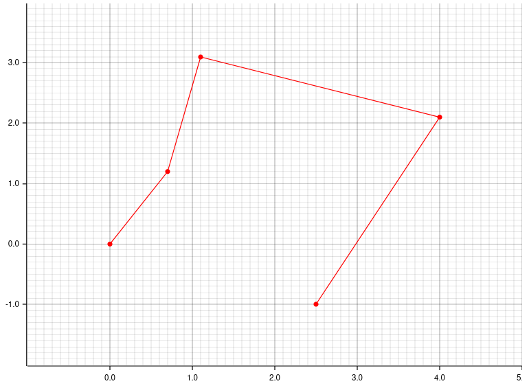
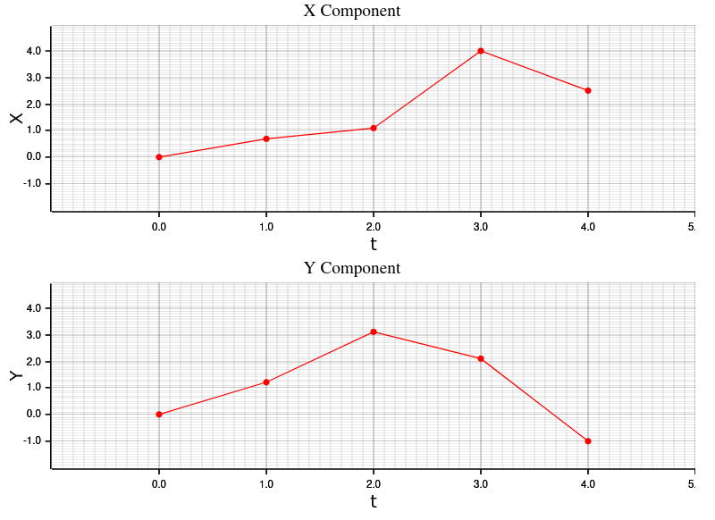
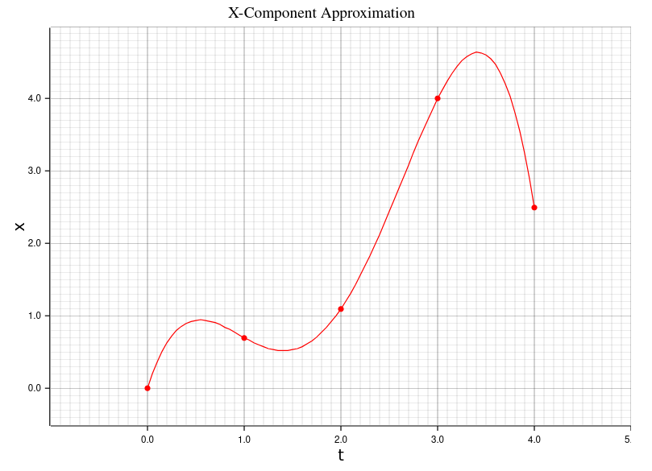

I do a lot of work in the CAD world and one of my tools is the spline, it
essentially gives you a way to tell the computer, *"here's a bunch of points,
please draw a smooth line that passes through them"*.

The term, *"spline"*, originally came from ship builders who would use flexible
strips of wood held using pegs to draw smooth curves, but nowadays the term can
refer to a variety of curves.

In an effort to explore the mathematics behind the various types of spline, I
thought I'd try to implement them myself and add them to [`arcs`][arcs], a
Rust CAD engine I've been playing around with in my spare time.

Here are some of the splines we can choose from:

- [Hermite Spline](https://en.wikipedia.org/wiki/Cubic_Hermite_spline) - the
  mathematical function you get when trying to minimise the "tension" in a
  flexible curve passing
- [B-Spline](https://en.wikipedia.org/wiki/B-spline)
- [NURBS](https://en.wikipedia.org/wiki/Non-uniform_rational_B-spline) - The
  general form of a *B-Spline*, used all over the place in CAM
- [Bézier Curve](https://en.wikipedia.org/wiki/B%C3%A9zier_curve) - sibling of
  the *B-Spline*, often used in fonts
- [Interpolated Cubic/Quadratic Spline][wiki] - what you get after fitting a
  polynomial to the curve

As the easiest for me to wrap my head around, I thought I'd start with the
[*Interpolated Spline*][wiki].

I'll try not to go too deeply into the maths. However, considering
computational geometry (the study of drawing things and doing geometry inside
a computer) is literally a field of mathematics, it's not possible to avoid
it altogether.

{}
The code written in this article is available [on GitHub][repo]. Feel free to
browse through and steal code or inspiration.

If you found this useful or spotted a bug, let me know on the blog's
[issue tracker][issue]!

[repo]: https://github.com/Michael-F-Bryan/arcs
[issue]: https://github.com/Michael-F-Bryan/adventures.michaelfbryan.com
{}

## The General Idea

Say you have a bunch of points and you'd like a smooth curve that passes
through them.

```Rust
let points = vec![
    Point::new(0.0, 0.0),
    Point::new(0.7, 1.2),
    Point::new(1.1, 3.1),
    Point::new(4.0, 2.1),
    Point::new(2.5, -1.0),
];
```

By far the easiest way to draw this is to just connect the dots, like so.



While it may feel a bit naive, for a lot of applications this can be quite
adequate. If the points are close together or don't change very much, the
difference between the "actual" curve which smoothly passes through each
point and our linear approximation will be pretty small.

But what if we *do* want a smooth curve, and a bunch of connected lines just
won't cut it?

Data scientists can often get away with using linear approximation over
something more complex because the numerical error tends to be pretty low,
but if you were an engineer drawing the shape of a seat or cushion its a lot
harder to get away with the sharp changes in direction linear approximation
will give you.

There is a mathematical technique referred to as [Interpolation][interpolate]
which looks at some data points and uses trends to estimate the shape of the
curve passing through them.

Ideally this interpolation process would give us a mathematical function
which...

1. Is continuous - there are no discontinuities (i.e. parts where the curve
   "jumps" between two locations instantaneously)
2. Is smooth - the slope of the line should also be continuous
3. Is easy to compute and work with - this makes the maths nicer and leads to
   better performance when calculated on a computer

There are many families of mathematical function, but [polynomials][poly]
best fit our criteria.

However, you'll notice something odd when trying to fit a polynomial to our
previous curve... There's no possible way we can create such a polynomial
because it fails [the vertical line test][vertical-test].

Luckily mathematics already has a tool for dealing with this. Instead of
creating a single polynomial which, given some $x$ position will provide the
$y$ location on the curve, we can introduce an intermediate variable, $t$ (I
normally think of it as the percentage along the curve or the segment
number), and ask for two equations mapping $t → x$ and $t → y$, respectively.

For example, this is what we get when applying linear approximation to the
$x$ and $y$ components in terms of $t$.



You can see that, by construction, it's not possible for these curves to
double back on themselves (i.e. fail the vertical line test), so we can
*always* find a polynomial that passes through each points.

# Finding our Interpolation Function

Okay, so now we know we're going to split the curve into its $x$ and $y$
components and interpolate them independently.

Given the set of points


\begin{align}
  (t_0, x_0), (t_1, x_1), (t_2, x_2), \ldots , (t_n, x_n)
\end{align}


One very simple way to do a curve fit for this is to write down a $n$-degree
polynomial.


\begin{align}
  x(t) = a_0 + a_1 t + a_2 t^2 \ldots + a_n t^n
\end{align}


If you look at this equation we've got $n + 1$ unknowns (the coefficients
$a_0, a_1, \ldots, a_n$) and we also have $n + 1$ constraints (our points).
That means we just need to do simultaneous equations to find the polynomial
coefficients. It's made even easier by the fact that each of the equations is
linear so solving becomes a simple matrix operation... and computers eat
matrix operations for breakfast.

If we're just wanting to calculate this curve for the original data's
x-component, substituting each $(t, x)$ pair into the above gives us the
following system of equations:


\begin{align}
  0 &= a_0 + a_1 * 0 + a_2 * 0^2 + a_3 * 0^3 + a_4 * 0^4 \\
  0.7 &= a_0 + a_1 * 1 + a_2 * 1^2 + a_3 * 1^3 + a_4 * 1^4 \\
  1.1 &= a_0 + a_1 * 2 + a_2 * 2^2 + a_3 * 2^3 + a_4 * 2^4 \\
  4 &= a_0 + a_1 * 3 + a_2 * 3^2 + a_3 * 3^3 + a_4 * 3^4 \\
  2.5 &= a_0 + a_1 * 4 + a_2 * 4^2 + a_3 * 4^3 + a_4 * 4^4
\end{align}


Which can be converted to matrix form.


\begin{align}
  A x = b \\
  \begin{bmatrix}
    1 & 0 & 0^1 & 0^2 & 0^3 & 0^4 \\
    1 & 1 & 1^1 & 1^2 & 1^3 & 1^4 \\
    1 & 2 & 2^1 & 2^2 & 2^3 & 2^4 \\
    1 & 3 & 3^1 & 3^2 & 3^3 & 3^4 \\
    1 & 4 & 4^1 & 4^2 & 4^3 & 4^4
  \end{bmatrix}
  \begin{bmatrix} a_0 \\ a_1 \\ a_2 \\ a_3 \\ a_4 \end{bmatrix} &=
  \begin{bmatrix} 0 \\ 0.7 \\ 1.1 \\ 4 \\ 2.5 \end{bmatrix}
\end{align}


{}
As a bonus, you'll notice there's a nice pattern for this matrix so
generating it turns into a couple trivial loops.
{}

Solving to get the coefficients can be done by pre-multiplying with the
inverse to get $x = A^{-1} b$.

With the use of [the `nalgebra` crate][nalgebra] we can solve for the
polynomial coefficients.

```rust
use nalgebra::base::*;

fn matrix(unknowns: usize) -> DMatrix<f64> {
    let d = Dynamic::new(unknowns);

    Matrix::from_fn_generic(d, d, |row, column| if column == 0 {
        1.0
    } else {
        (row as f64).powi(column as i32)
    })
}

let a: DMatrix<f64> = matrix(5);
let b: DMatrix<f64> = DMatrix::from_column_slice(5, 1, &[0.0, 0.7, 1.1, 4.0, 2.5]);

let solution: DMatrix<f64> = a.try_inverse().unwrap() * b;
let coefficients: Vec<f64> = solution.column(0).into_iter().copied().collect();
```

And as a sanity check, let's use them to try and predict the $x$-coordinates
for our points.

```rust
fn polynomial(t: f64, coefficients: &[f64]) -> f64 {
    coefficients.iter()
        .enumerate()
        .map(|(i, coefficient)| coefficient * t.powi(i as i32))
        .sum()
}

println!("Coefficients: {:?}", coefficients);

for t in 0 .. 5 {
    let got = polynomial(t as f64, &coefficients);
    println!("({}, {})", t, got);
}
```

Prints out:

```
Coefficients: [0.0, 4.208333333333336, -5.995833333333335,
               2.8916666666666666, -0.4041666666666667]

(0, 0)
(1, 0.7000000000000003)
(2, 1.099999999999996)
(3, 3.999999999999993)
(4, 2.4999999999999716)
```

Or displayed graphically...



Ignoring floating-point errors, that looks pretty good to me 🎉

If we wanted to, we could even package this all up into a `Polynomial` type.

```rust
#[derive(Debug, Clone, PartialEq)]
pub struct Polynomial {
    coefficients: Vec<f64>,
}

impl Polynomial {
    pub fn approximating_data(points: &[f64]) -> Self
    {
        let dim = Dynamic::new(points.len());

        let a = Matrix::from_fn_generic(dim, dim, |row, column| if column == 0 {
                1.0
            } else {
                (row as f64).powi(column as i32)
            });
        let b = DMatrix::from_column_slice(points.len(), 1, points);

        let solution = a.try_inverse().expect("Always invertible") * b;
        let coefficients = solution.column(0).into_iter().copied().collect();

        Polynomial { coefficients }
    }

    pub fn eval(&self, t: f64) -> f64 {
        let mut value = 0.0;

        for (i, coefficient) in self.coefficients.iter().enumerate() {
            value +=  coefficient * t.powi(i as i32);
        }

        value
    }
}
```

[arcs]: https://github.com/Michael-F-Bryan/arcs
[wiki]: https://en.wikipedia.org/wiki/Polynomial_interpolation
[interpolate]: https://en.wikipedia.org/wiki/Interpolation
[poly]: https://en.wikipedia.org/wiki/Polynomial
[vertical-test]: https://en.wikipedia.org/wiki/Vertical_line_test
[nalgebra]: https://crates.io/crates/nalgebra
