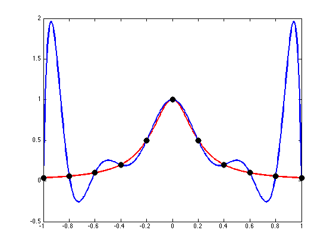

I do a lot of work in the CAD world and one of my tools is the spline, it
essentially gives you a way to tell the computer, *"here's a bunch of points,
please draw a smooth line that passes through them"*.

The term, *"spline"*, originally came from ship builders who would use flexible
strips of wood held using pegs to draw smooth curves, but nowadays the term can
refer to a variety of curves.

In an effort to explore the mathematics behind the various types of spline, I
thought I'd try to implement them myself and add them to [`arcs`][arcs], a
Rust CAD engine I've been playing around with in my spare time.

Here are some of the splines we can choose from:

- [Hermite Spline](https://en.wikipedia.org/wiki/Cubic_Hermite_spline) - the
  mathematical function you get when trying to minimise the "tension" in a
  flexible curve passing
- [B-Spline](https://en.wikipedia.org/wiki/B-spline)
- [NURBS](https://en.wikipedia.org/wiki/Non-uniform_rational_B-spline) - The
  general form of a *B-Spline*, used all over the place in CAM
- [Bézier Curve](https://en.wikipedia.org/wiki/B%C3%A9zier_curve) - sibling of
  the *B-Spline*, often used in fonts
- [Interpolated Cubic/Quadratic Spline][wiki] - what you get after fitting a
  polynomial to the curve

As the easiest for me to wrap my head around, I thought I'd start with the
[*Interpolated Spline*][wiki].

I'll try not to go too deeply into the maths. However, considering
computational geometry (the study of drawing things and doing geometry inside
a computer) is literally a field of mathematics, it's not possible to avoid
it altogether.

{}
The code written in this article is available [on GitHub][repo]. Feel free to
browse through and steal code or inspiration.

If you found this useful or spotted a bug, let me know on the blog's
[issue tracker][issue]!

[repo]: https://github.com/Michael-F-Bryan/arcs
[issue]: https://github.com/Michael-F-Bryan/adventures.michaelfbryan.com
{}

## The General Idea

Say you have a bunch of points and you'd like a smooth curve that passes
through them.

```Rust
let points = vec![
    Point::new(0.0, 0.0),
    Point::new(0.7, 1.2),
    Point::new(1.1, 3.1),
    Point::new(4.0, 2.1),
    Point::new(2.5, -1.0),
];
```

By far the easiest way to draw this is to just connect the dots, like so.


While it may feel a bit naive, for a lot of applications this can be quite
adequate. If the points are close together or don't change very much, the
difference between the "actual" curve which smoothly passes through each
point and our linear approximation will be pretty small.

But what if we *do* want a smooth curve, and a bunch of connected lines just
won't cut it?

Data scientists can often get away with using linear approximation over
something more complex because the numerical error tends to be pretty low,
but if you were an engineer drawing the shape of a seat or cushion its a lot
harder to get away with the sharp changes in direction linear approximation
will give you.

There is a mathematical technique referred to as [Interpolation][interpolate]
which looks at some data points and uses trends to estimate the shape of the
curve passing through them.

<span id="desired-properties"></span>

Ideally this interpolation process would give us a mathematical function
which...

1. Is continuous - there are no discontinuities (i.e. parts where the curve
   "jumps" between two locations instantaneously)
2. Is smooth - the slope of the line should also be continuous
3. Is easy to compute and work with - this makes the maths nicer and leads to
   better performance when calculated on a computer

There are many families of mathematical function, but [polynomials][poly]
best fit our criteria.

However, you'll notice something odd when trying to fit a polynomial to our
previous curve... There's no possible way we can create such a polynomial
because it fails [the vertical line test][vertical-test].

Luckily mathematics already has a tool for dealing with this. Instead of
creating a single polynomial which, given some $x$ position will provide the
$y$ location on the curve, we can introduce an intermediate variable, $t$ (I
normally think of it as the percentage along the curve or the segment
number), and ask for two equations mapping $t → x$ and $t → y$, respectively.

For example, this is what we get when applying linear approximation to the
$x$ and $y$ components in terms of $t$.


You can see that, by construction, it's not possible for these curves to
double back on themselves (i.e. fail the vertical line test), so we can
*always* find a polynomial that passes through each points.

# Finding our Interpolation Function

Okay, so now we know we're going to split the curve into its $x$ and $y$
components and interpolate them independently.

Given the set of points


\begin{align}
  (t_0, x_0), (t_1, x_1), (t_2, x_2), \ldots , (t_n, x_n)
\end{align}


One very simple way to do a curve fit for this is to write down a $n$-degree
polynomial.


\begin{align}
  x(t) = a_0 + a_1 t + a_2 t^2 \ldots + a_n t^n
\end{align}


If you look at this equation we've got $n + 1$ unknowns (the coefficients
$a_0, a_1, \ldots, a_n$) and we also have $n + 1$ constraints (our points).
That means we just need to do simultaneous equations to find the polynomial
coefficients. It's made even easier by the fact that each of the equations is
linear so solving becomes a simple matrix operation... and computers eat
matrix operations for breakfast.

If we're just wanting to calculate this curve for the original data's
x-component, substituting each $(t, x)$ pair into the above gives us the
following system of equations:


\begin{align}
  0 &= a_0 + a_1 * 0 + a_2 * 0^2 + a_3 * 0^3 + a_4 * 0^4 \\
  0.7 &= a_0 + a_1 * 1 + a_2 * 1^2 + a_3 * 1^3 + a_4 * 1^4 \\
  1.1 &= a_0 + a_1 * 2 + a_2 * 2^2 + a_3 * 2^3 + a_4 * 2^4 \\
  4 &= a_0 + a_1 * 3 + a_2 * 3^2 + a_3 * 3^3 + a_4 * 3^4 \\
  2.5 &= a_0 + a_1 * 4 + a_2 * 4^2 + a_3 * 4^3 + a_4 * 4^4
\end{align}


Which can be converted to matrix form.


\begin{align}
  A x = b \\
  \begin{bmatrix}
    1 & 0 & 0^1 & 0^2 & 0^3 & 0^4 \\
    1 & 1 & 1^1 & 1^2 & 1^3 & 1^4 \\
    1 & 2 & 2^1 & 2^2 & 2^3 & 2^4 \\
    1 & 3 & 3^1 & 3^2 & 3^3 & 3^4 \\
    1 & 4 & 4^1 & 4^2 & 4^3 & 4^4
  \end{bmatrix}
  \begin{bmatrix} a_0 \\ a_1 \\ a_2 \\ a_3 \\ a_4 \end{bmatrix} &=
  \begin{bmatrix} 0 \\ 0.7 \\ 1.1 \\ 4 \\ 2.5 \end{bmatrix}
\end{align}


{}
As a bonus, you'll notice there's a nice pattern for this matrix so
generating it turns into a couple trivial loops.
{}

Solving to get the coefficients can be done by pre-multiplying with the
inverse to get $x = A^{-1} b$.

With the use of [the `nalgebra` crate][nalgebra] we can solve for the
polynomial coefficients.

```rust
use nalgebra::base::*;

fn matrix(unknowns: usize) -> DMatrix<f64> {
    let d = Dynamic::new(unknowns);

    Matrix::from_fn_generic(d, d, |row, column| if column == 0 {
        1.0
    } else {
        (row as f64).powi(column as i32)
    })
}

let a: DMatrix<f64> = matrix(5);
let b: DMatrix<f64> = DMatrix::from_column_slice(5, 1, &[0.0, 0.7, 1.1, 4.0, 2.5]);

let solution: DMatrix<f64> = a.try_inverse().unwrap() * b;
let coefficients: Vec<f64> = solution.column(0).into_iter().copied().collect();
```

And as a sanity check, let's use them to try and predict the $x$-coordinates
for our points.

```rust
fn polynomial(t: f64, coefficients: &[f64]) -> f64 {
    coefficients.iter()
        .enumerate()
        .map(|(i, coefficient)| coefficient * t.powi(i as i32))
        .sum()
}

println!("Coefficients: {:?}", coefficients);

for t in 0 .. 5 {
    let got = polynomial(t as f64, &coefficients);
    println!("({}, {})", t, got);
}
```

Prints out:

```
Coefficients: [0.0, 4.208333333333336, -5.995833333333335,
               2.8916666666666666, -0.4041666666666667]

(0, 0)
(1, 0.7000000000000003)
(2, 1.099999999999996)
(3, 3.999999999999993)
(4, 2.4999999999999716)
```

Or displayed graphically...


Ignoring floating-point errors, that looks pretty good to me 🎉

If we wanted to, we could even package this all up into a `Polynomial` type.

```rust
#[derive(Debug, Clone, PartialEq)]
pub struct Polynomial {
    coefficients: Vec<f64>,
}

impl Polynomial {
    pub fn approximating_data(points: &[f64]) -> Self
    {
        let dim = Dynamic::new(points.len());

        let a = Matrix::from_fn_generic(dim, dim, |row, column| if column == 0 {
                1.0
            } else {
                (row as f64).powi(column as i32)
            });
        let b = DMatrix::from_column_slice(points.len(), 1, points);

        let solution = a.try_inverse().expect("Always invertible") * b;
        let coefficients = solution.column(0).into_iter().copied().collect();

        Polynomial { coefficients }
    }

    pub fn eval(&self, t: f64) -> f64 {
        let mut value = 0.0;

        for (i, coefficient) in self.coefficients.iter().enumerate() {
            value +=  coefficient * t.powi(i as i32);
        }

        value
    }
}
```

This all seems well and good, but an interesting phenomena emerges as you start
trying to get the interpolation function for more and more points.

To show this effect, I've created a `quadratic()` function which evaluates
$x = 3 - t + 5 t^2$.

In theory, no matter how many inputs we provide, our `Polynomial` abstraction
should find that the "best" function for interpolating our data has the
coefficients `[3, -1, 5]` because that's what we used to generate the points
in the first place.


```rust
fn quadratic(t: usize) -> f64 {
    let t = t as f64;

    5.0 * t * t - t + 3.0
}

for num_points in 14..23 {
    let data_points: Vec<_> = (0..num_points)
        .map(quadratic)
        .collect();
    let poly = Polynomial::approximating_data(&data_points);

    println!(
      "Coefficients with {} points: {:.4?}",
      data_points.len(),
      significant_coefficients(&poly),
    );
}
```

But that's not what we see when increasing the number of points from 14 to
23...

```
Coefficients with 14 points: [3.0000, -1.0000, 5.0000]
Coefficients with 15 points: [3.0000, -1.0002, 5.0000]
Coefficients with 16 points: [3.0000, -1.0025, 5.0001]
Coefficients with 17 points: [3.0000, -0.9956, 5.0061, -0.0017]
Coefficients with 18 points: [3.0000, -1.1404, 5.0015, 0.0032]
Coefficients with 19 points: [3.0000, -1.3804, 5.1542, -0.0022, -0.0088, 0.0023]
Coefficients with 20 points: [3.0000, 27.2128, -5.6370, 1.7740, -0.1443, 0.0024]
Coefficients with 21 points: [3.0000, 66.5303, 8.2934, -1.1984, 0.1849, -0.0202]
Coefficients with 22 points: [3.0000, 615.5219, -90.7595, 7.4350, 0.0597, -0.0945, 0.0139, -0.0013]
```

You can see for lower numbers of points it figures out the coefficients for
our quadratic just fine, but around 16 points it starts to diverge.

By 19 points we're no longer using our perfect quadratic for approximation,
and some higher order coefficients (e.g. cubic and quartic) are starting to
come into play.

Then when we reach 20 or more points our original quadratic is all but
unrecognisable.

{}
The technical term for this is [Runge's phenomenon][runge-phenomenon], named
after [Carl David Tolmé Runge][runge-wiki] (of [Runge–Kutta][runge-kutta]
fame), who discovered it while exploring the behaviour of errors when using
polynomial interpolation to approximate certain functions.

You can think of it as the interpolation analogue of [overfitting your
data][overfitting].

By construction the resulting polynomial will always pass through our
original points. However as we add more terms, the larger terms start to
dominate and become too big to to be cancelled out (which would give us the
smoothness we desire). Even if the 5th coefficient is something small like
$-0.0945$, $-0.0945 \times t^5$ is going to be a big number.

See how the higher order terms are causing large oscillations towards the
endpoints in the graph below (red is the actual curve, blue is our polynomial
approximation). The interpolated curve is only really usable between the
three central data points.



[runge-phenomenon]: https://en.wikipedia.org/wiki/Runge%27s_phenomenon
[runge-wiki]: https://en.wikipedia.org/wiki/Carl_David_Tolm%C3%A9_Runge
[runge-kutta]: https://en.wikipedia.org/wiki/Runge%E2%80%93Kutta_methods
[overfitting]: https://en.wikipedia.org/wiki/Overfitting
{}

Luckily for us, there are a couple techniques we can use to avoid
*Runge's phenomenon*.

## Interpolation Using Cubic Polynomials

Okay, so we've seen that using a n-degree polynomial to draw a curve through
n points isn't ideal. But if you look back at [the desired
properties](#desired-properties) we wrote down earlier, you might notice we
don't actually care how many terms our approximation function uses, only that
it is continuous and smooth.

So let's take a different approach.

What if, instead of creating a single function which can be used for
interpolation across the entire domain, we use a series of smaller
polynomials which are only valid for their particular segment?

That's the approach used by quadratic and cubic interpolated splines.

It's easy enough to make sure a piecewise polynomial is continuous, in fact
we can get that for free by saying that each piece in our curve starts and
ends on a data point.

Likewise, because polynomials with degree 2 or greater are able to change
their slope (compared to a line which, by definition, can only be straight)
when solving for our coefficients we can add a constraint that at the slope
is continuous at each segment endpoint. That solves our "smooth" requirement
as well.

While we didn't mention it earlier, a lot of real world applications like
graphic arts, engineering, and manufacturing also care about splines having
continuous (i.e. change in slope).

This throws a spanner in the works if we want to use segments based on
quadratic polynomials. Because the second derivative of a quadratic is always
a constant there's no way to specify a constraint that the second derivative
is constant across segment endpoints. Constants can't change, so it's almost
like we've run out of the variables/flexibility we need. That's why a lot of
interpolated splines are based on cubic polynomials instead.

Okay, so we know we're going to use segments approximated using cubics, now
what?

Well [according to Wikipedia][cubic-spline-algorithm] the cubic, $f(t) = x$
 that passes through the points $(t_0, x_0), \ldots (t_3, x_3)$ can be written
 as


\begin{align}
f(t) &= {\big (}1-k(t){\big )} y_{1} +
        k(t) y_{2} +
        k(t){\big (}1-k(t){\big )}{\Big (}{\big (}1-k(t){\big )}\,a+k(t)\,b{\Big )} \\
\textit{where:} & \\
k(t) &= \frac{t - t_0}{t_1 - t_0} \\
a &=k_{1}(x_{2}-x_{1})-(y_{2}-y_{1}) \\
b &=-k_{2}(x_{2}-x_{1})+(y_{2}-y_{1})
\end{align}





[arcs]: https://github.com/Michael-F-Bryan/arcs
[wiki]: https://en.wikipedia.org/wiki/Polynomial_interpolation
[interpolate]: https://en.wikipedia.org/wiki/Interpolation
[poly]: https://en.wikipedia.org/wiki/Polynomial
[vertical-test]: https://en.wikipedia.org/wiki/Vertical_line_test
[nalgebra]: https://crates.io/crates/nalgebra
[cubic-spline-algorithm]: https://en.wikipedia.org/wiki/Spline_interpolation#Algorithm_to_find_the_interpolating_cubic_spline
