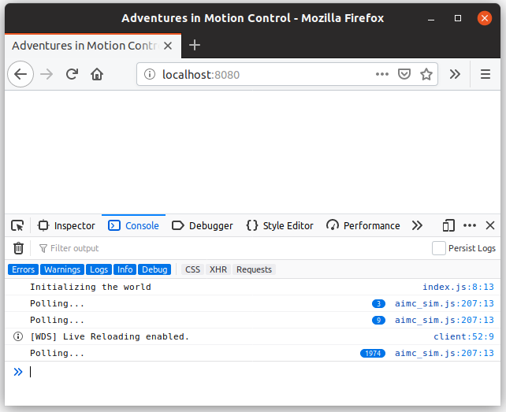

--- 
title: "Top-Level Infrastructure"
date: "2019-09-02T21:22:30+08:00"
tags:
- adventures-in-motion-control
- rust
---

As mentioned in [the intro article][next-step], the first task will be to set
up the application's structure and define how the various components will
communicate.

## Multitasking

Most embedded systems will implement multi-tasking by rapidly polling each
system within an infinite loop.

```rust
loop {
    poll_comms();
    poll_motion_planning();
    poll_io();
    poll_machine_events();
}
```

A motion controller will normally spend most of its time polling, but there are
places where polling isn't appropriate. For example, accurate movement of a
stepper motor relies on sending pulses at very precise times. Another scenario
is in the handling of communication, where waiting for the next poll to read a
byte may result in missing part of a message.

To deal with this embedded systems use [interrupts][interrupt], callbacks which
will preempt the normal flow of execution to handle an event. These callbacks,
referred to as *Interrupt Service Routines*, will then do the bare minimum
required to handle the event so execution can be resumed as quickly as
possible. 

For example, this may happen by saving the event to memory (e.g.
*"received `0x0A` over serial"*) so it can be handled by the appropriate
system when it is polled next.

## Inter-System Communication

Now we know that systems will do work by being polled frequently, lets think
about how they'll interact with the rest of the application. 

In general a system works by reading state, evaluating some logic using that
state, then propagate the results of that logic by sending messages to the
rest of the system (or even to the real world via IOs).

Systems will be polled infinitely and are the top-most level of logic so they
must handle every possible error, even if that is just done by entering a fault
state. It doesn't make sense for `poll()` to return an error (who would
handle the error?)... Or anything, for that matter.

From that, we've got a rough image of what a system may look like:

```rust
trait System<In, Out> {
    fn poll(&mut self, inputs: &In, outputs: &mut Out);
}
```

## Keeping Track of Time

An important responsibility for a motion controller is being able to change
the value of something over time (hence the *motion* in *motion controller*).
Timing is used all over the place and each motion controller will have its
own way of tracking the time (remember that there may not necessarily be an
OS meaning we can't depend on `std::time::SystemTime`), so lets pull this
out into its own trait.

```rust
use core::time::Duration;

trait Clock: Sync {
    /// The amount of time that has elapsed since some arbitrary point in time
    /// (e.g. when the program started).
    fn elapsed(&self) -> Duration;
}
```

{}
A `Clock` will be shared by almost every system and a reference may be passed
across threads. Hence the `&self` in `elapsed()` and the `Sync` bound.
{}

{}
Extracting the concept of time into its own trait is especially handy during 
testing. It can also be used to make time run faster than the usual 1 second
per second (e.g. fast-forward).
{}

## Layers

To reduce coupling and make things more manageable, we'll take advantage of
[Cargo Workspaces][workspaces] to break the project into layers.

At the very bottom is our *Hardware Abstraction Layer* (HAL). This defines
the various platform-agnostic interfaces used by the application.

Next we have the various drivers (e.g. stepper motor control) and systems (e.g.
communication and motion planning). These are built on top of the HAL and 
are where most of the application is implemented.

At the very top is the application itself, an in-browser simulator in our case.
Its role is to glue the various components together, performing the necessary
setup before polling the various systems ad infinitum.

Our app's dependency graph may look something like this:


graph BT;
    H[Hardware Abstraction Layer];
    B[In-Browser Simulator];
    C[Comms System];
    P[Motion Planning];
    S[Stepper Axis Driver];
    F[Flash Memory];

    H-->C;
    H-->P;
    H-->F;
    H-->S;

    F-->B;
    S-->B;
    P-->B;
    C-->B;


## Hello, World!

Now we've got a better idea of how the application might be structured it's
time to stub out enough of the frontend to see things run.

I won't explain each step in setting up a Rust WASM project (the 
[Rust and WebAssembly][wasm-book] book already does a great job at that!), but
here's the gist of it:

```console
$ cargo generate --git https://github.com/rustwasm/wasm-pack-template --name sim
 Creating project called `sim`...
 Done! New project created /home/michael/Documents/adventures-in-motion-control/sim
$ cd sim && wasm-pack build
$ ls pkg
 aimc_sim.d.ts aimc_sim.js aimc_sim_bg.d.ts aimc_sim_bg.wasm package.json
 README.md sim.d.ts sim.js sim_bg.d.ts sim_bg.wasm
$ cd ..
$ npm init wasm-app frontend
 npx: installed 1 in 2.523s
 🦀 Rust + 🕸 Wasm = ❤
$ cd frontend && yarn install
$ yarn add ../sim/pkg
$ yarn run start
 yarn run v1.15.2
 webpack-dev-server
 ℹ ｢wds｣: Project is running at http://localhost:8080/
 ℹ ｢wds｣: webpack output is served from /
 ℹ ｢wds｣: Content not from webpack is served from /home/michael/Documents/adventures-in-motion-control/frontend
 ℹ ｢wdm｣: Hash: 93fc66658e148c72a97a
 Version: webpack 4.39.3
 Time: 467ms
 Built at: 09/02/2019 7:24:22 PM
                            Asset       Size  Chunks             Chunk Names
                   0.bootstrap.js    3.4 KiB       0  [emitted]  
 8e8fa9289c240ac706a1.module.wasm  872 bytes       0  [emitted]  
                     bootstrap.js    367 KiB    main  [emitted]  main
                       index.html  297 bytes          [emitted]  
 Entrypoint main = bootstrap.js
```

The project now looks something like this ([commit `69e68832`][69e68832]):

- adventures-in-motion-control/
  - Cargo.toml
  - hal/
    - src/
      - lib.rs
      - clock.rs
      - system.rs
  - sim/
    - src/
      - lib.rs
      - utils.rs
  - frontend/
    - package.json
    - bootstrap.js
    - index.js
    - index.html

I normally use [`cargo-watch`][cargo-watch] to recompile and run my project's
test suite whenever a change is made, but doing the same with `wasm-pack` and
`yarn` takes a little extra effort. Instead, we'll need to work with
[`watchexec`][watchexec] directly.

```console
$ watchexec \
    # Clear the screen every time 
    --clear \
    # The webpack dev server will still be running, make sure it is restarted
    --restart \
    # These files are changed when running  `wasm-pack` and `yarn add`
    --ignore 'sim/pkg/*' \
    --ignore 'frontend/package.json' \
    --ignore 'frontend/yarn.lock' \
    --ignore 'frontend/node_modules/*' \
    # The actual command to execute whenever something changes
    'wasm-pack build sim && cd frontend && yarn add ../sim/pkg && yarn start'
```

{}
Webpack won't automatically detect the `sim/pkg/` directory's contents have
changed (I'm guessing the folder's contents are copied to `node_modules/`?).
That means we need to manually run `yarn add ../sim/pkg` every time the WASM
code changes.
{}

Lets stub out an `App` type. This will contain the world's state, with a 
reference being passed to the JavaScript frontend so it can be periodically
polled.

```rust
// sim/src/app.rs

use aimc_hal::{clock::Clock, System};
use wasm_bindgen::prelude::*;

#[wasm_bindgen]
#[derive(Debug)]
pub struct App;

impl<In: Inputs, Out: Frontend> System<In, Out> for App {
    fn poll(&mut self, _inputs: &In, _outputs: &mut Out) {
        outputs.log("Polling...");
     }
}

/// The mechanism used by the [`App`] to interact with the outside world.
pub trait Frontend {
    /// Log a message somewhere.
    fn log(&mut self, message: &str);
}

pub trait Inputs { }
```

{}
The `Input` and `Frontend` traits are what our `App` will use to communicate
with the outside world. By putting it behind a trait instead of binding to
JavaScript objects directly our `sim` crate will be able to compile on the
host platform. This makes testing and debugging significantly easier and
*isn't* a case of [*premature generalization*][pg]... At least I hope
it isn't.

[pg]: https://blogs.msdn.microsoft.com/ericgu/2006/08/03/seven-deadly-sins-of-programming-sin-1/
{}

Platform-specific code gets put in its own module which will be wrapped in a 
`#[cfg(target_arch = "wasm32")]` attribute. It's pretty empty for now, but
we'll be adding to it before long.

```rust
// sim/src/platform_specific.rs

use wasm_bindgen::JsValue;

#[derive(Debug, Clone, Default)]
pub struct Inputs;

impl crate::app::Inputs for Inputs { }

#[derive(Debug, Clone, Default)]
pub struct Browser;

impl crate::app::Frontend for Browser {
    fn log(&mut self, msg: &str) {
        let msg = JsValue::from(msg);
        web_sys::console::log_1(&msg);
    }
}
```

We also need to expose functions which will let JavaScript create the world
and poll it.

```rust
// sim/src/lib.rs

pub mod app;
#[cfg(target_arch = "wasm32")]
mod platform_specific;

pub use app::App;

use wasm_bindgen::prelude::*;

#[wasm_bindgen(start)]
pub fn on_module_loaded() {
    // wire up pretty panic messages
    #[cfg(feature = "console_error_panic_hook")]
    console_error_panic_hook::set_once();
}

/// Creates a new world, initializing the various systems and wiring up any
/// necessary interrupts.
#[wasm_bindgen]
#[cfg(target_arch = "wasm32")]
pub fn setup_world() -> App { App }

/// Poll the application, running each system in turn and letting them make
/// progress.
#[wasm_bindgen]
#[cfg(target_arch = "wasm32")]
pub fn poll(app: &mut App) {
    use aimc_hal::System;
    use platform_specific::{Browser, Inputs};

    let inputs = Inputs::default();
    let mut frontend = Browser::default();

    app.poll(&inputs, &mut frontend);
}
```

Now the `sim` crate is exposing `setup_world()` and `poll()`, we can wire it
up to the browser.

Something to note about JavaScript running in a browser is that an infinite loop
will prevent anything else from executing, locking the entire window up. This 
isn't great. 

The trick to implementing an infinite "loop" in JavaScript is to use 
[`window.requestAnimationFrame()`][raf] to schedule some `animate()` function
to be called, then make sure `animate()` calls `requestAnimationFrame(animate)`
so it'll be called again.

```js
// frontend/index.js

import * as wasm from "aimc-sim";

let world;

function init() {
    console.log("Initializing the world");
    world = wasm.setup_world();
    requestAnimationFrame(animate);
}

function animate() {
    wasm.poll(world);
    requestAnimationFrame(animate);
}

init();
```

Going to the dev server (http://localhost:8080/) should show an empty page,
however if you open up the developer console you should see something like this:



It may not look impressive, but to just get that *"Polling..."* message we
needed to:

1. Compile the `sim` crate to WebAssembly
2. Import that WebAssembly from a JavaScript application and make sure JS can
   call our WASM functions
3. Bundle the JavaScript and WebAssembly together and send it to a browser
4. Initialize the world when the window is first loaded
5. Call `wasm.poll()` from an JavaScript function that is called whenever the
   browser paints
6. Poll the underlying `App`, passing in a set of dummy `Inputs` and a `Browser`
   object
7. Invoke that browser's `log()` method
8. Call back into JavaScript's `console.log()` function

## The Next Step

Now the main application is wired up and we can run code in the browser the next
step is to add some systems to our application. 

A relatively easy, yet important, component is some sort of FPS counter. Ideally
there'll be a bit of text in the corner showing the number of `poll()`s per
second and the average duration. That way we can get a better feel for our
simulator's performance characteristics.

[next-step]: 
[interrupt]: https://en.wikipedia.org/wiki/Interrupt
[workspaces]: https://doc.rust-lang.org/book/ch14-03-cargo-workspaces.html
[wasm-book]: https://rustwasm.github.io/book/game-of-life/setup.html
[69e68832]: https://github.com/Michael-F-Bryan/adventures-in-motion-control/commit/69e68832299e459068b4263676bb9fc20987f03a
[cargo-watch]: https://crates.io/crates/cargo-watch
[watchexec]: https://crates.io/crates/watchexec
[raf]: https://developer.mozilla.org/en-US/docs/Web/API/window/requestAnimationFrame
